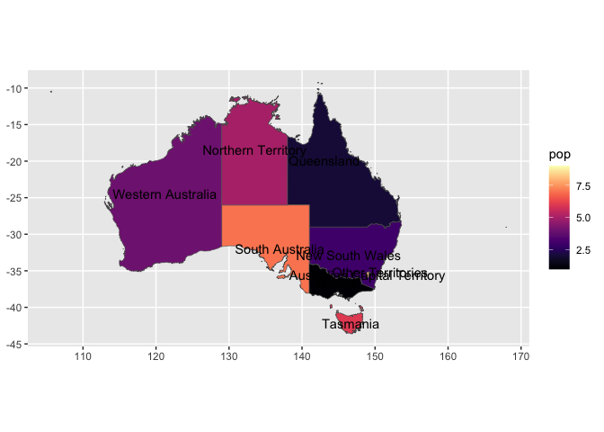
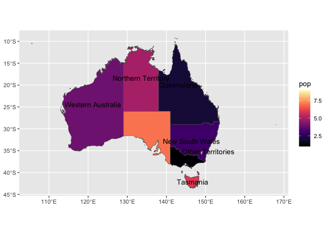
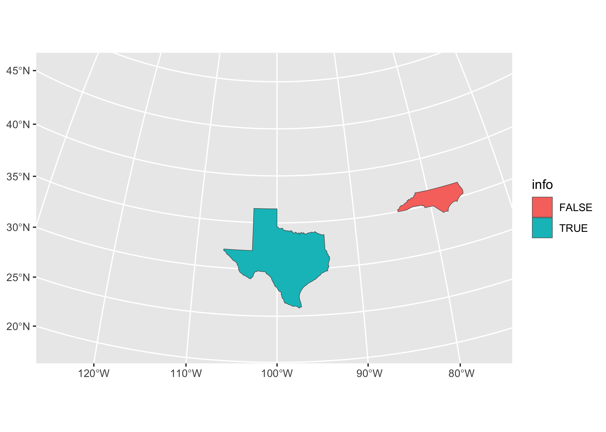
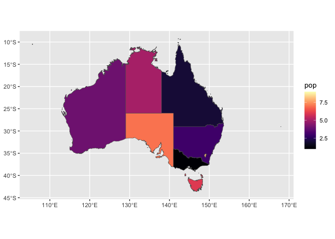
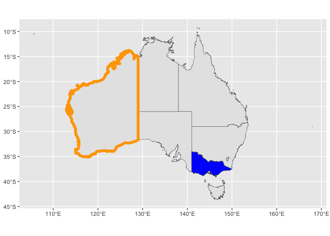
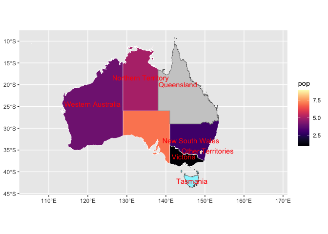
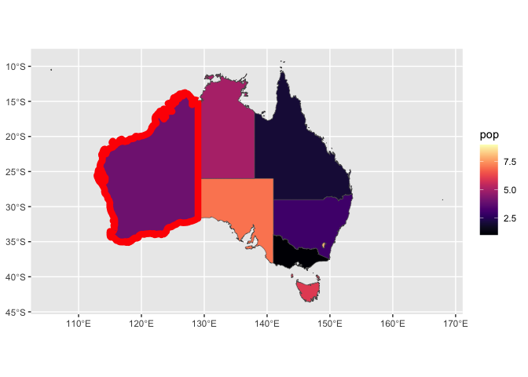

- [{ggregions}](#ggregions)
- [Motivations](#motivations)
- [What {ggregions} will deliver](#what-ggregions-will-deliver)
  - [Effortlessly write new geom\_\* region-specific
    functions](#effortlessly-write-new-geom_-region-specific-functions)
  - [Deliver intuitive, newcomer-welcoming spatial viz
    experience](#deliver-intuitive-newcomer-welcoming-spatial-viz-experience)
- [Status quo and implementation demonstrations,
  ideas](#status-quo-and-implementation-demonstrations-ideas)
  - [Status Quo: Inconsistent APIs or leave the data manipulation to the
    user.](#status-quo-inconsistent-apis-or-leave-the-data-manipulation-to-the-user)
- [Alternative: Toward region-specific
  layer-writing](#alternative-toward-region-specific-layer-writing)
  - [Step 1. Define compute](#step-1-define-compute)
  - [Step 2. Define Stat](#step-2-define-stat)
  - [Step 3. Create `write_geom_region()` and friends and
    test](#step-3-create-write_geom_region-and-friends-and-test)
  - [Australia example w/
    `write_geom_region()`](#australia-example-w-write_geom_region)
  - [US state example w/
    `write_geom_region()`](#us-state-example-w-write_geom_region)
- [Minimal Packaging](#minimal-packaging)
  - [Some exploratory work done with
    `make_constructor`](#some-exploratory-work-done-with-make_constructor)
  - [Step 3.b Make geom_region (and friends) that brings along
    coords_sf() (currently not fully
    argumented)](#step-3b-make-geom_region-and-friends-that-brings-along-coords_sf-currently-not-fully-argumented)
  - [Step 4. demo region-specific user-facing functions… just for
    demonstration
    purposes!](#step-4-demo-region-specific-user-facing-functions-just-for-demonstration-purposes)
  - [nc test](#nc-test)

<!-- README.md is generated from README.Rmd. Please edit that file -->

<!-- badges: start -->

[](https://lifecycle.r-lib.org/articles/stages.html#experimental)
<!-- badges: end -->

# {ggregions}

[Link to RMedicine
Talk](https://evamaerey.github.io/mytidytuesday/2026-04-03-r-medicine-ggregions/r-medicine-ggregions.html#1)

Note: foundation work for this package has been conducted in many
experiments
([1](https://evamaerey.github.io/mytidytuesday/2025-09-15-make_constructor_sf/make_constructor_sf.html),
[2](https://evamaerey.github.io/mytidytuesday/2024-07-12-sf-experiment-fastStat/sf-experiment-fastStat.html),
[3](https://evamaerey.github.io/mytidytuesday/2024-06-13-usmaps-ggusa/usmaps-ggusa.html),
[4](https://evamaerey.github.io/mytidytuesday/2024-06-13-usmaps-ggusa/usmaps-ggusa-Stat-and-geom-sf.html),
[5](https://evamaerey.github.io/mytidytuesday/2024-04-08-statsf_errors/statsf_errors.html),
[6](https://evamaerey.github.io/mytidytuesday/2023-03-12-ggbrain-seg-sf/ggbrain_seg_sf.html),
[7](https://evamaerey.github.io/mytidytuesday/2023-03-12-ggbrain-seg-sf/ggbrain_seg_dk_sf.html),
[8](https://evamaerey.github.io/mytidytuesday/2023-03-10-ggfips/ggfips_w_sf.html),
[9](https://evamaerey.github.io/mytidytuesday/2023-03-10-ggfips/ggfips.html),
[10](https://evamaerey.github.io/mytidytuesday/2023-03-10-brain2/brain2.html),
[11](https://evamaerey.github.io/mytidytuesday/2023-03-09-nc-fips/nc-fips.html),
[12](https://evamaerey.github.io/mytidytuesday/2023-03-07-extending-your-ability/extending_your_ability.html),
[13](https://evamaerey.github.io/mytidytuesday/2023-03-06-us-states/us_states.html)
), [a number of
discussions](https://github.com/search?q=repo%3Aggplot2-extenders%2Fggplot-extension-club+sf2stat&type=discussions)
and in conversation based on my
[talk](https://evamaerey.github.io/mytidytuesday/2023-04-13-ggcircle-pack-talk/circle_pack_and_beyond_talk.html#86)
in the ggplot2 extenders group, and a couple of experimental packages
([sf2stat](https://github.com/EvaMaeRey/sf2stat) and
[ggsomewhere](https://github.com/EvaMaeRey/ggsomewhere)).

For an example of how the ggregions utility might be used in a specific
geographic context, see [ggusmap](https://github.com/EvaMaeRey/ggusmap),
which uses the superb data prepared by [Paolo Di
Lorenzo](https://github.com/pdil) for the usmap and usmapdata packages.

# Motivations

> I am told there are people who do not care for maps, and I find it
> hard to believe. - Robert Louis Stevenson

> ‘My teacher, Mr. Jayson, says a map is a picture of someplace from
> above. It’s like flying over that spot in an airplane.’ - ‘Lisa’ in
> Loreen Leedy’s in ‘Mappying Penny’s World’

> I hate when I work with spatial data that so much of my mindshare goes
> to thinking about ‘how do I wrangle this this map and what on earth is
> going on’ versus the actual meaning behind what I’m trying to map. -
> Emily Riederer

Maps are some of the most compelling and intuitive data visualizations,
and they are some of the first visualizations people will come across in
their lives. There is great support for mapping in R and in the data
visualization library {ggplot2} which supports many R packages.

However, producing a simple map, like a choropleth, can feel much harder
than producing other plots, like a scatterplot for example in ggplot2. A
scatter plot is produced by:

``` r
ggplot(scatter_data) + # data
   aes(x = x, y = y) + # position and other visual channel mapping
   geom_point()        # layer 
```

In other words, you might say, ‘used this data, and points, and the
positions are defined by x and y’

This proposal posits that by investing in methods to easily create new
geo-specific ggplot2 layer extensions (geom\_\*s), producing maps with
ggplot2 can become as intuitive as creating other plots. About
specifying a map, you might say, ‘use this data, draw regions, position
and color fill according to var1 and var2.’

The proposed regions mapping might look something like this:

``` r
ggplot(mapping_data) +              # data
   aes(region_id = var1_region_id,  # position mapping 
       fill = var2) +               # and other visual channel mapping
   geom_region()                    # layer
```

> Your API feels like it actually puts the “question” at the center.. -
> Emily Riederer

# What {ggregions} will deliver

## Effortlessly write new geom\_\* region-specific functions

The {ggregions} package (in proof-of-concept phase) will allow
geographic data package writers to quickly create easy-to-use ggplot2
layer extensions that adhere to the ggplot2 ‘grammar’.

First, the authors will prepare a reference dataset that contains a
[geometry](https://ggplot2.tidyverse.org/reference/ggsf.html#geometry-aesthetic),
sfc-containing column as well as columns of allowed identifiers for the
regions of interest. For example, the identifiers from in
`us_states_ref` from `usmapdata::us_map()`, are `state_name`, `fips` and
`state_abbr`.

``` r
library(dplyr)

# Step 1. prep some of their geo reference data
us_states_ref <- usmapdata::us_map() |>
  select( state_name = full, # state_name will positional aes like x or y 
          state_abbr = abbr, 
          fips,
          geometry = geom,  # one column with geometry is required
         )  # state_abbr will also be optional positional aes like x or y

head(us_states_ref)
#> Simple feature collection with 6 features and 3 fields
#> Geometry type: MULTIPOLYGON
#> Dimension:     XY
#> Bounding box:  xmin: -2584074 ymin: -2602555 xmax: 1431301 ymax: -39590.54
#> Projected CRS: NAD27 / US National Atlas Equal Area
#>   state_name state_abbr fips                       geometry
#> 1     Alaska         AK   02 MULTIPOLYGON (((-2390688 -2...
#> 2    Alabama         AL   01 MULTIPOLYGON (((1091785 -13...
#> 3   Arkansas         AR   05 MULTIPOLYGON (((482022.2 -9...
#> 4    Arizona         AZ   04 MULTIPOLYGON (((-1386064 -1...
#> 5 California         CA   06 MULTIPOLYGON (((-1716581 -1...
#> 6   Colorado         CO   08 MULTIPOLYGON (((-787705.6 -...
```

Then, authors will be able use `write_geom_region()` to create a
regions-specific ggplot2 layer, for example `geom_us_state()` below,
which can be made available in their geo packages.

``` r
# Step 2. use `write_geom_region`
library(ggregions)
geom_us_state <- write_geom_region(ref_data = us_states_ref)
#> Error in write_geom_region(ref_data = us_states_ref): could not find function "write_geom_region"
```

## Deliver intuitive, newcomer-welcoming spatial viz experience

By including the newly specified `geom_` function in their geo data
package (perhaps instead or in addition to a convenience wrapper that
are typical of geo packages) the package *users* will be able to use
the`data + aes + geom` formulation for defining their plots. Instead of
positional aesthetics like x, y or geometry, a region identifier like
`state_name` or `fips` can be used. Internally, the regions `geom_*`
will translate between place name or other identifier to the necessary
borders (`sfc`s).

Below is some tabular data with geographic region identifiers, but no
boundaries:

``` r
us_income <- tidyr::us_rent_income |> 
  filter(variable == "income") |>
  rename(income = estimate)

head(us_income)
#> # A tibble: 6 × 5
#>   GEOID NAME       variable income   moe
#>   <chr> <chr>      <chr>     <dbl> <dbl>
#> 1 01    Alabama    income    24476   136
#> 2 02    Alaska     income    32940   508
#> 3 04    Arizona    income    27517   148
#> 4 05    Arkansas   income    23789   165
#> 5 06    California income    29454   109
#> 6 08    Colorado   income    32401   109
```

Even though there is no boundary information, analysts can map this data
with the familiar data + aesthetic mapping + layer syntax that makes
ggplot2 easy to read, write, and reason about.

``` r
library(ggplot2)
library(usmapdata)

ggplot(data = us_income) + 
  aes(state_name = NAME, 
      fill = income) + 
  geom_us_state()
#> Error in geom_us_state(): could not find function "geom_us_state"
```

Packages that might take avantage of ggregion’s functionality include
[afrimapr](https://afrimapr.github.io/afrimapr.website/),
[geobr](https://ipeagit.github.io/geobr/),
[cancensus](https://mountainmath.github.io/cancensus/index.html),
[chilemapas](https://pacha.dev/chilemapas/),
[RCzechia](https://github.com/jlacko/RCzechia),
[geofi](https://ropengov.github.io/geofi/) ,
[geokz](https://github.com/arodionoff/geokz),
[mapsPERU](https://github.com/musajajorge/mapsPERU) and
[geoidep](https://geografo.pe/geoidep/index.html),
[mapSpain](https://github.com/rOpenSpain/mapSpain/),
[geographr](https://github.com/britishredcrosssociety/geographr),
[geouy](https://github.com/RichDeto/geouy),
[tigris](https://github.com/walkerke/tigris), and
[rgeoboundaries](https://github.com/wmgeolab/rgeoboundaries). Since
these geo packages have many users, the impacts of `{ggregions}` could
be significant.

# Status quo and implementation demonstrations, ideas

## Status Quo: Inconsistent APIs or leave the data manipulation to the user.

``` r
library(tidyverse)
library(ozmaps)
sf_oz <- ozmap("states")


# some data that we want to viz
au_states <- tribble(~state, ~pop,
        "Victoria", 1,
        "Queensland", 2,
        "New South Wales", 3,
        "Western Australia", 4,
        "Northern Territory", 5,
        "Tasmania", 6,
        "South Australia", 7,
        "Australian Capital Territory", 8,
        "Other Territories", 9
        )

sf_oz |> names()
#> [1] "NAME"     "geometry"

sf_oz |>
  full_join(au_states, by = join_by(NAME == state )) |> 
  ggplot() + 
  aes(geometry = geometry, fill = pop) + 
  geom_sf()
```

# Alternative: Toward region-specific layer-writing

## Step 1. Define compute

We’ll look at the Australian states case as we go, but the ref_data
argument will keep thing generic.

``` r
australia_state_ref <- sf_oz |>
  select(state_name = NAME)
```

``` r
compute_panel_regions <- function(data, scales, ref_data, keep = NULL, drop = NULL, stamp = F){

ref_data$id <- ref_data[1][[1]]

if(!is.null(keep)){ref_data <- ref_data |> dplyr::filter(id %in% keep)}
if(!is.null(drop)){ref_data <- ref_data |> dplyr::filter(!(id %in% drop))}

ref_data <- ref_data |> 
    ggplot2::StatSf$compute_panel(coord = ggplot2::CoordSf) |> # add bounding boxes xmin xmax etc
    ggplot2::StatSfCoordinates$compute_group(coord = ggplot2::CoordSf) # add x and y centers

if(!stamp){ ref_data |> dplyr::inner_join(data) } else { ref_data }

}
```

### Test Compute

``` r
au_states |> 
  rename(state_name = state) |>
  compute_panel_regions(ref_data = australia_state_ref)
#> Simple feature collection with 9 features and 9 fields
#> Geometry type: MULTIPOLYGON
#> Dimension:     XY
#> Bounding box:  xmin: 105.5507 ymin: -43.63203 xmax: 167.9969 ymax: -9.229287
#> Geodetic CRS:  GDA94
#> # A tibble: 9 × 10
#>   state_name                  geometry id     xmin  xmax  ymin  ymax     x     y
#>   <chr>             <MULTIPOLYGON [°]> <chr> <dbl> <dbl> <dbl> <dbl> <dbl> <dbl>
#> 1 New South… (((150.7016 -35.12286, 1… New …  106.  168. -43.6 -9.23  146. -32.8
#> 2 Victoria   (((146.6196 -38.70196, 1… Vict…  106.  168. -43.6 -9.23  145. -36.6
#> 3 Queensland (((148.8473 -20.3457, 14… Quee…  106.  168. -43.6 -9.23  143. -19.9
#> 4 South Aus… (((137.3481 -34.48242, 1… Sout…  106.  168. -43.6 -9.23  137. -32.0
#> 5 Western A… (((126.3868 -14.01168, 1… West…  106.  168. -43.6 -9.23  121. -24.4
#> 6 Tasmania   (((147.8397 -40.29844, 1… Tasm…  106.  168. -43.6 -9.23  147. -42.2
#> 7 Northern … (((136.3669 -13.84237, 1… Nort…  106.  168. -43.6 -9.23  133. -18.4
#> 8 Australia… (((149.2317 -35.222, 149… Aust…  106.  168. -43.6 -9.23  149. -35.5
#> 9 Other Ter… (((167.9333 -29.05421, 1… Othe…  106.  168. -43.6 -9.23  151. -35.2
#> # ℹ 1 more variable: pop <dbl>
```

To do/consider

- [ ] warnings about not plot data that fails to find a match in ref
  data
- [ ] allowing multiple geo reference data sets with different
  resolutions?
- [ ] more flexibility on specifying the id column (now it is the first
  column in the dataset)
- [ ] other?

## Step 2. Define Stat

``` r
# compute just reproduced verbatim from above for packaging purposes
#' Compute panel regions
#'
#' @description
#' A short description...
#'
#' @param data A data frame.
#' @param scales Scales.
#' @param ref_data A reference data frame.
#' @param keep A character vector of IDs to keep. Optional.
#' @param drop A character vector of IDs to drop. Optional.
#' @param stamp A single logical value. Optional.
#'
#' @returns
#' A data frame. If `stamp` is `FALSE`, the processed `ref_data` inner-joined with `data`.
#' Otherwise, the processed `ref_data`.
#'
#' @export
compute_panel_regions <- function(data, scales, ref_data, keep = NULL, 
                                  drop = NULL, stamp = F){

  ref_data$id <- ref_data[1][[1]]

  if(!is.null(keep)){ref_data <- ref_data |> dplyr::filter(id %in% keep)}
  if(!is.null(drop)){ref_data <- ref_data |> dplyr::filter(!(id %in% drop))}

  ref_data <- ref_data |> 
    ggplot2::StatSf$compute_panel(coord = ggplot2::CoordSf) |>
    ggplot2::StatSfCoordinates$compute_group(coord = ggplot2::CoordSf)

  if(!stamp){ ref_data |> dplyr::inner_join(data) } else { ref_data }

}


StatRegion <- ggplot2::ggproto("StatRegion",
                      ggplot2::Stat,
                      compute_panel = compute_panel_regions,
                      default_aes = ggplot2::aes(label = ggplot2::after_stat(id)))
```

### To do/consider

- [ ] Stat won’t warn about required_aes, since none are declared. We
  anticipate allowed aes to be quite varied. How otherwise can this be
  addressed?
- [ ] Think through, experiment if compute_group might also work, and if
  it is preferable

### Test Stat

``` r
ggplot(au_states) +
  aes(state_name = state) +
  geom_sf(stat = StatRegion, ref_data = australia_state_ref) + 
  geom_text(stat = StatRegion, ref_data = australia_state_ref) +
  aes(fill = pop)
```

<!-- -->

### Test Stat X GeomSF w/ `make_constructor()`

We can define user facing function with `make_constructor`. However, for
greater usability coord_sf(), is included in the user-facing geom_sf()
function, and we will want to do this too.

``` r
geom_au_state_no_coords <- 
  make_constructor(GeomSf, 
                   stat = StatRegion, 
                   ref_data = australia_state_ref)

geom_au_state_text_no_coords <- 
  make_constructor(GeomText, 
                   stat = StatRegion, 
                   ref_data = australia_state_ref)

crs_au_states <- sf::st_crs(sf_oz)

ggplot(au_states) +
  aes(state_name = state) + 
  geom_au_state_no_coords() + 
  geom_au_state_text_no_coords(check_overlap = T) + 
  aes(fill = pop) +
  coord_sf(crs = crs_au_states)
```

<!-- -->

``` r
# Note, in fact, errors w/o coord_sf, and we want to choose the right crs
ggplot(au_states) +
   aes(state_name = state) + 
   geom_au_state_no_coords() 
#> Error in `geom_au_state_no_coords()`:
#> ! Problem while converting geom to grob.
#> ℹ Error occurred in the 1st layer.
#> Caused by error in `draw_panel()`:
#> ! `geom_sf()` can only be used with `coord_sf()`.
```

## Step 3. Create `write_geom_region()` and friends and test

<details Arrow to see details>

``` r
# when the crs is NULL, st_crs unfortunately returns, na, but we would like it to return NULL
st_crs_mod <- function(ref_data){

  crs <- sf::st_crs(ref_data)
  
  if(is.na(crs)){NULL}else{crs}

}


geom_region <- function (mapping = aes(), data = NULL, stat = StatRegion, position = "identity", 
    na.rm = FALSE, show.legend = NA, inherit.aes = TRUE, ref_data, ...) 
{
    c(layer_sf(geom = GeomSf, data = data, mapping = mapping, 
        stat = stat, position = position, show.legend = show.legend, 
        inherit.aes = inherit.aes, params = rlang::list2(na.rm = na.rm, ref_data = ref_data, 
            ...)), 
    coord_sf(crs = st_crs_mod(ref_data)))
}


#' @export
write_geom_region <- function(ref_data = australia_state_ref, required_aes = NULL){

  modified_fun <- geom_region

  formals(modified_fun)$ref_data <- substitute(ref_data)

  return(modified_fun)

}


# all the arguments should be passed
stamp_region <- function (mapping = aes(), data = ref_data, stat = StatRegion, position = "identity", 
    na.rm = FALSE, show.legend = NA, inherit.aes = FALSE, ref_data, ...) 
{
    c(layer_sf(geom = GeomSf, data = data, mapping = mapping, 
        stat = stat, position = position, show.legend = show.legend, 
        inherit.aes = inherit.aes, params = rlang::list2(na.rm = na.rm, ref_data = ref_data, stamp = T,
            ...)), 
    coord_sf(crs = st_crs_mod(ref_data)))
}


#' @export
write_stamp_region <- function(ref_data = australia_state_ref, required_aes = NULL){

  modified_function <- stamp_region

formals(modified_function)$ref_data <- substitute(ref_data)

return(modified_function)

}


# all the arguments should be passed
geom_region_text <- function (mapping = aes(), data = NULL, stat = StatRegion,
                              position = "identity", 
    na.rm = FALSE, show.legend = NA, inherit.aes = TRUE, ref_data, ...) 
{
    c(layer_sf(geom = GeomText, data = data, mapping = mapping, 
        stat = stat, position = position, show.legend = show.legend, 
        inherit.aes = inherit.aes, params = rlang::list2(na.rm = na.rm, ref_data = ref_data, 
            ...)), 
    coord_sf(crs = st_crs_mod(ref_data)))
}


#' @export
write_geom_region_text <- function(ref_data, required_aes = NULL){

  modified_function <- geom_region_text

  formals(modified_function)$ref_data <- substitute(ref_data)

return(modified_function)

}


# all the arguments should be passed
# all the arguments should be passed
stamp_region_text <- function (mapping = aes(), data = ref_data, stat = StatRegion,
                              position = "identity", 
    na.rm = FALSE, show.legend = NA, inherit.aes = FALSE, ref_data, ...) 
{
    c(layer_sf(geom = GeomText, data = data, mapping = mapping, 
        stat = stat, position = position, show.legend = show.legend, 
        inherit.aes = inherit.aes, params = rlang::list2(na.rm = na.rm, ref_data = ref_data, stamp = T,
            ...)), 
    coord_sf(crs = st_crs_mod(ref_data)))
}


#' @export
write_stamp_region_text <- function(ref_data, required_aes = NULL){

  modified_function <- stamp_region_text

  formals(modified_function)$ref_data <- substitute(ref_data)

  return(modified_function)

}
```

</details>

## Australia example w/ `write_geom_region()`

``` r
sf_oz <- ozmap("states")
```

<!-- -->

``` r

australia_state_ref <- sf_oz |>
  select(state_name = NAME)

geom_au_state <- write_geom_region(ref_data = australia_state_ref)
stamp_au_state <- write_stamp_region(ref_data = australia_state_ref)
geom_au_state_text <- write_geom_region_text(ref_data = australia_state_ref)
stamp_au_states_text <- write_stamp_region_text(ref_data = australia_state_ref)

au_states |> 
  ggplot() + 
  aes(state_name = state, fill = pop) + 
  stamp_au_state() +
  geom_au_state(drop = c("Western Australia", "Victoria")) + #aes(fill = NULL)
  geom_au_state(keep = "Tasmania", fill = "cadetblue2") + 
  stamp_au_states_text(keep = "Tasmania")
```

<!-- -->

``` r

library(ggplot2)
ggplot() + 
  stamp_au_state() + 
  stamp_au_state(keep = "Victoria", fill = "blue") + 
  stamp_au_state(keep = "Western Australia", 
                 fill = NA,
                 color = "orange",
                 linewidth = 2)
```

<!-- -->

## US state example w/ `write_geom_region()`

``` r
us_states_ref <- usmapdata::us_map() |>
  rename(geometry = geom,
         state_name = full,
         state_abbr = abbr) |>
  select(state_name, everything())
  
geom_us_state <- write_geom_region(us_states_ref)
stamp_us_state <- write_stamp_region(us_states_ref)
geom_us_state_text <- write_geom_region_text(us_states_ref)
stamp_us_states_text <- write_stamp_region_text(us_states_ref)


us_rent_income |> 
  filter(variable == "income") |>
  ggplot() + 
  aes(state_name = NAME, fill = estimate) + 
  geom_us_state() + 
  scale_fill_viridis_c(option = "magma") + 
  stamp_us_states_text(color = "white",
                       aes(label = after_stat(state_abbr)))
```

<!-- -->

# Minimal Packaging

### Do once

``` r
devtools::create(".")
usethis::use_lifecycle_badge("experimental")
```

### Do manually and in readme

``` r
knitrExtra::chunk_to_dir("StatRegion")
knitrExtra::chunk_to_dir("geom_region0")
knitrExtra::chunk_to_dir("write_geom_region")

usethis::use_package("ggplot2")
usethis::use_package("sf")
usethis::use_package("dplyr")

# rm(list = ls())
devtools::document()
```

### Do manually (time consuming)

``` r
devtools::check(".")
devtools::install(pkg = ".", upgrade = "never")
```

## Some exploratory work done with `make_constructor`

<details>

``` r
GeomSfStamp <- ggplot2::ggproto("GeomSfStamp", ggplot2::GeomSf,
                       default_aes = modifyList(ggplot2::GeomSf$default_aes, 
                                                ggplot2::aes(fill = ggplot2::from_theme(scales::col_mix(ink, paper, 0.8))), 
                                                keep.null = T))

geom_region0 <- ggplot2::make_constructor(ggplot2::GeomSf, stat = StatRegion) 
stamp_region0 <- ggplot2::make_constructor(GeomSfStamp, stat = StatRegion, stamp = T, inherit.aes = F)
geom_region_text0 <- ggplot2::make_constructor(ggplot2::GeomText, stat = StatRegion)
stamp_region_text0 <- ggplot2::make_constructor(ggplot2::GeomText, stat = StatRegion, stamp = T, inherit.aes = F)
```

## Step 3.b Make geom_region (and friends) that brings along coords_sf() (currently not fully argumented)

``` r
# all the arguments *should* be passed, but this for the sake of demo
geom_region <- function(..., ref_data){
  c(geom_region0(..., ref_data = ref_data), 
    coord_sf(crs = st_crs_mod(ref_data)))
}

# all the arguments *should* be passed, but this for the sake of demo
stamp_region <- function(..., ref_data){
  c(stamp_region0(..., ref_data = ref_data), 
    coord_sf(crs = st_crs_mod(ref_data)))
}

geom_region_text <- function(..., ref_data){
  c(geom_region_text0(..., ref_data = ref_data), 
    coord_sf(crs = st_crs_mod(ref_data)))
}

stamp_region_text <- function(..., ref_data){
  c(stamp_region_text0(..., ref_data = ref_data), 
    coord_sf(crs = st_crs_mod(ref_data)))
}
```

## Step 4. demo region-specific user-facing functions… just for demonstration purposes!

Not argumented. We’ll return to this later.

``` r
# all arguments above that should be passed, could be passed, or, 
geom_au_states <- function(...){geom_region(..., ref_data = australia_state_ref)}
stamp_au_states <- function(...){stamp_region(..., ref_data = australia_state_ref)}
geom_au_states_text <- function(...){geom_region_text(..., ref_data = australia_state_ref)}
stamp_au_states_text <- function(...){stamp_region_text(..., ref_data = australia_state_ref)}
```

### Test

``` r
au_states |> 
  sample_n(5) |> 
  ggplot() +
  aes(state_name = state) + 
  stamp_au_states() +
  geom_au_states()
```

<!-- -->

``` r

au_states |>
ggplot() +
  aes(state_name = state, fill = pop) + 
  geom_au_states(color = "white") +
  stamp_au_states(keep = "Tasmania", 
                  fill = "cadetblue1"
                  ) +
  stamp_au_states(keep = "Queensland") + 
  geom_au_states_text(color = "red",
                      check_overlap = T)  
```

<!-- -->

``` r


last_plot() + 
  geom_au_states(fill = "cadetblue1")
```

<!-- -->

``` r

au_states |>
  ggplot() +
  aes(state_name = state) + 
  geom_au_states(aes(fill = pop)) + 
  stamp_au_states(color = "red", keep = "Western Australia",
                  fill = NA, linewidth = 3)
```

<!-- -->

## nc test

``` r
nc_ref <- sf::st_read(system.file("shape/nc.shp", package="sf")) |>
  select(county_name = NAME, fips = FIPS)
#> Reading layer `nc' from data source 
#>   `/Library/Frameworks/R.framework/Versions/4.5-arm64/Resources/library/sf/shape/nc.shp' 
#>   using driver `ESRI Shapefile'
#> Simple feature collection with 100 features and 14 fields
#> Geometry type: MULTIPOLYGON
#> Dimension:     XY
#> Bounding box:  xmin: -84.32385 ymin: 33.88199 xmax: -75.45698 ymax: 36.58965
#> Geodetic CRS:  NAD27

geom_nc_county <- function(...){geom_region(..., ref_data = nc_ref)}

nc_data <- sf::st_read(system.file("shape/nc.shp", package="sf")) |>
  sf::st_drop_geometry()
#> Reading layer `nc' from data source 
#>   `/Library/Frameworks/R.framework/Versions/4.5-arm64/Resources/library/sf/shape/nc.shp' 
#>   using driver `ESRI Shapefile'
#> Simple feature collection with 100 features and 14 fields
#> Geometry type: MULTIPOLYGON
#> Dimension:     XY
#> Bounding box:  xmin: -84.32385 ymin: 33.88199 xmax: -75.45698 ymax: 36.58965
#> Geodetic CRS:  NAD27

nc_data |>
  ggplot() +
  aes(county_name = NAME,
      fill = AREA) + 
  geom_nc_county(color = "white")
```

<!-- -->

</details>
