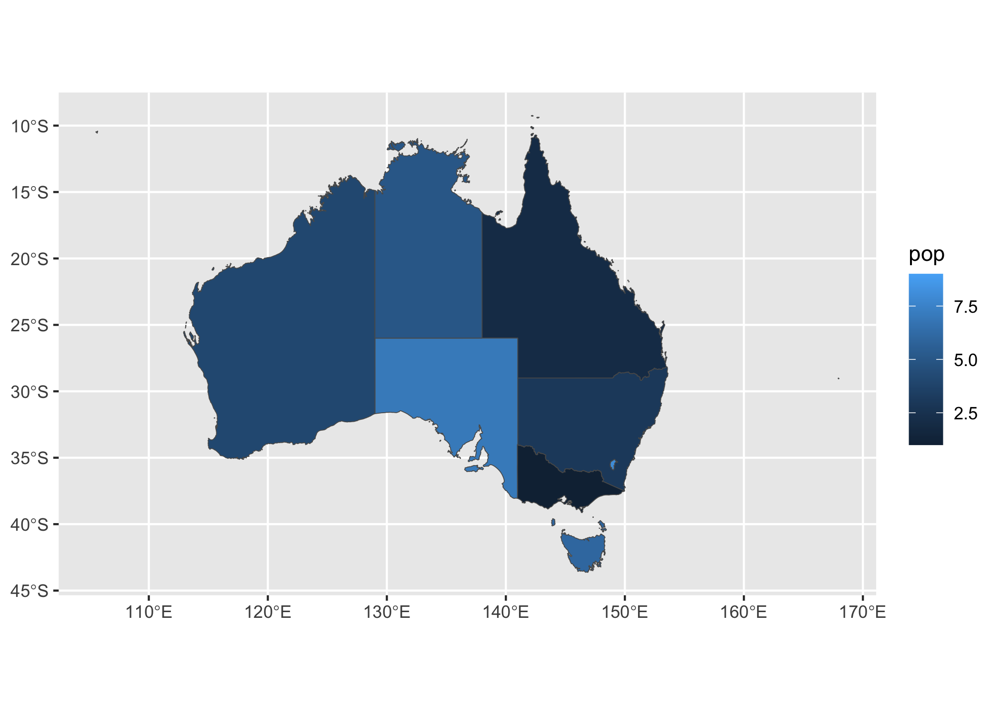
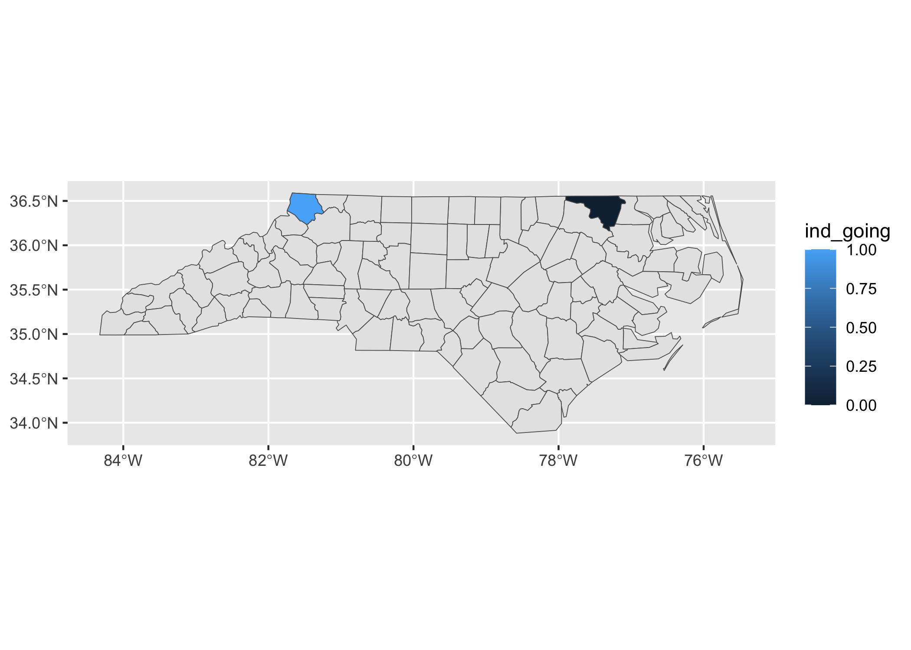
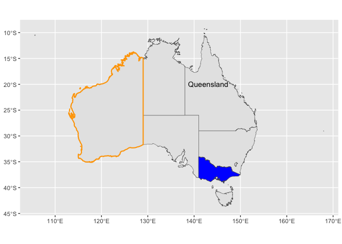
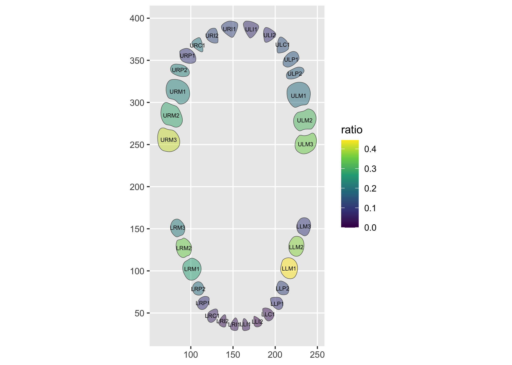
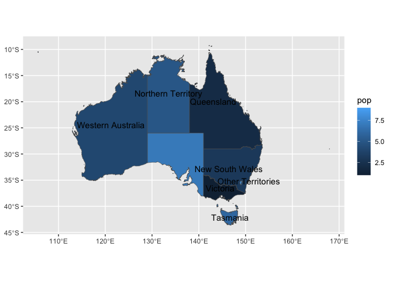
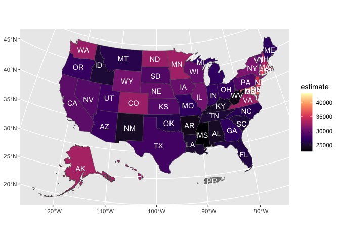
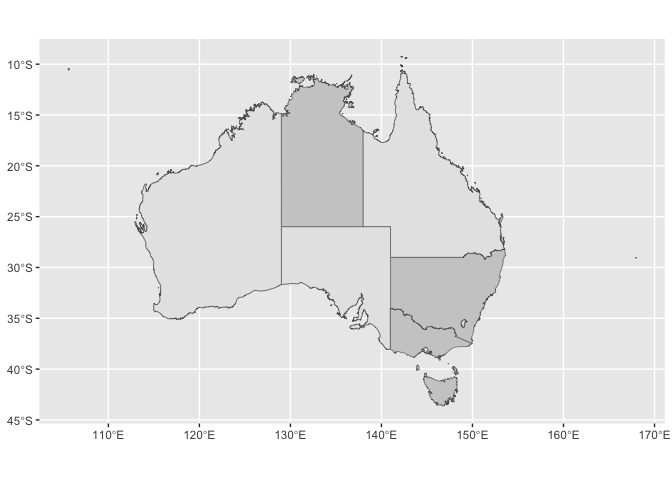

- [{ggregions}](#ggregions)
- [Motivations](#motivations)
  - [Status Quo (without ggregions): Leave the data manipulation to the
    user, or wrapper
    APIs](#status-quo-without-ggregions-leave-the-data-manipulation-to-the-user-or-wrapper-apis)
- [What {ggregions} delivers](#what-ggregions-delivers)
  - [Interface \#1. Standard interface for visualizing regions and
    locales, `aes(region = my_var) + geom_region()` where scope of
    interest is declared via
    `options()`.](#interface-1-standard-interface-for-visualizing-regions-and-locales-aesregion--my_var--geom_region-where-scope-of-interest-is-declared-via-options)
    - [North Carolina example (sf
      package)](#north-carolina-example-sf-package)
    - [Australia example (ozmaps)](#australia-example-ozmaps)
    - [Brazil example (geobr)](#brazil-example-geobr)
    - [Brain example (ggseg)](#brain-example-ggseg)
    - [Dental example (teethr)](#dental-example-teethr)
    - [Countries example
      (rnaturalearth)](#countries-example-rnaturalearth)
    - [US counties example (usmapdata)](#us-counties-example-usmapdata)
    - [Texas counties (tigris)](#texas-counties-tigris)
    - [Anatomy example (from polygons to sf)
      (gganatogram)](#anatomy-example-from-polygons-to-sf-gganatogram)
  - [Interface \#2. use write\_\*() functions to specify reference data
    for
    layers.](#interface-2-use-write_-functions-to-specify-reference-data-for-layers)
    - [North Carolina example](#north-carolina-example)
    - [US example](#us-example)
- [Minimal Packaging](#minimal-packaging)
  - [Do once](#do-once)
  - [Do manually and in readme](#do-manually-and-in-readme)
  - [Do manually (time consuming)](#do-manually-time-consuming)
- [Previous, recent implementation and experiments, see
  source](#previous-recent-implementation-and-experiments-see-source)

<!-- README.md is generated from README.Rmd. Please edit that file -->

<!-- badges: start -->

[](https://lifecycle.r-lib.org/articles/stages.html#experimental)
<!-- badges: end -->

# {ggregions}

R Medicine Talk
[slides](https://evamaerey.github.io/mytidytuesday/2026-04-03-r-medicine-ggregions/r-medicine-ggregions.html#1)

COWY-ASA Talk 2026-05-08
[slides](https://evamaerey.github.io/mytidytuesday/2026-04-03-r-medicine-ggregions/asa-cowy-ggregions.html#1)

Note: foundation work for this package has been conducted in many
experiments
([1](https://evamaerey.github.io/mytidytuesday/2025-09-15-make_constructor_sf/make_constructor_sf.html),
[2](https://evamaerey.github.io/mytidytuesday/2024-07-12-sf-experiment-fastStat/sf-experiment-fastStat.html),
[3](https://evamaerey.github.io/mytidytuesday/2024-06-13-usmaps-ggusa/usmaps-ggusa.html),
[4](https://evamaerey.github.io/mytidytuesday/2024-06-13-usmaps-ggusa/usmaps-ggusa-Stat-and-geom-sf.html),
[5](https://evamaerey.github.io/mytidytuesday/2024-04-08-statsf_errors/statsf_errors.html),
[6](https://evamaerey.github.io/mytidytuesday/2023-03-12-ggbrain-seg-sf/ggbrain_seg_sf.html),
[7](https://evamaerey.github.io/mytidytuesday/2023-03-12-ggbrain-seg-sf/ggbrain_seg_dk_sf.html),
[8](https://evamaerey.github.io/mytidytuesday/2023-03-10-ggfips/ggfips_w_sf.html),
[9](https://evamaerey.github.io/mytidytuesday/2023-03-10-ggfips/ggfips.html),
[10](https://evamaerey.github.io/mytidytuesday/2023-03-10-brain2/brain2.html),
[11](https://evamaerey.github.io/mytidytuesday/2023-03-09-nc-fips/nc-fips.html),
[12](https://evamaerey.github.io/mytidytuesday/2023-03-07-extending-your-ability/extending_your_ability.html),
[13](https://evamaerey.github.io/mytidytuesday/2023-03-06-us-states/us_states.html)
), [a number of
discussions](https://github.com/search?q=repo%3Aggplot2-extenders%2Fggplot-extension-club+sf2stat&type=discussions)
and in conversation based on my
[talk](https://evamaerey.github.io/mytidytuesday/2023-04-13-ggcircle-pack-talk/circle_pack_and_beyond_talk.html#86)
in the ggplot2 extenders group, and a couple of experimental packages
([sf2stat](https://github.com/EvaMaeRey/sf2stat) and
[ggsomewhere](https://github.com/EvaMaeRey/ggsomewhere)).

For an example of how the ggregions utility might be used in a specific
geographic context, see [ggusmap](https://github.com/EvaMaeRey/ggusmap),
which uses the superb data prepared by [Paolo Di
Lorenzo](https://github.com/pdil) for the usmap and usmapdata packages.

# Motivations

> I am told there are people who do not care for maps, and I find it
> hard to believe. - Robert Louis Stevenson

> ‘My teacher, Mr. Jayson, says a map is a picture of someplace from
> above. It’s like flying over that spot in an airplane.’ - ‘Lisa’ in
> Loreen Leedy’s in ‘Mappying Penny’s World’

> I hate when I work with spatial data that so much of my mindshare goes
> to thinking about ‘how do I wrangle this this map and what on earth is
> going on’ versus the actual meaning behind what I’m trying to map. -
> Emily Riederer

Maps are some of the most compelling and intuitive data visualizations,
and they are some of the first visualizations people will come across in
their lives. There is great support for mapping in R and in the data
visualization library {ggplot2} which supports many R packages.

However, producing a simple map, like a choropleth, can feel much harder
than producing other plots, like a scatterplot for example in ggplot2. A
scatter plot is produced by:

``` r
ggplot(scatter_data) + # data
   aes(x = x, y = y) + # position and other visual channel mapping
   geom_point()        # layer 
```

In other words, you might say, ‘used this data, and points, and the
positions are defined by x and y’

This proposal posits that by investing in methods to easily create new
geo-specific ggplot2 layer extensions (geom\_\*s), producing maps with
ggplot2 can become as intuitive as creating other plots. About
specifying a map, you might say, ‘use this data, draw regions, position
and color fill according to var1 and var2.’

The proposed regions mapping might look something like this:

``` r
ggplot(mapping_data) +              # data
   aes(region = var1_region_id,  # position mapping 
       fill = var2) +               # and other visual channel mapping
   geom_region()                    # layer
```

> Your API feels like it actually puts the “question” at the center.. -
> Emily Riederer

## Status Quo (without ggregions): Leave the data manipulation to the user, or wrapper APIs

``` r
library(tidyverse)
library(ozmaps)
sf_oz <- ozmap("states")
```

``` r
# some data that we want to viz
au_states <- tribble(~state, ~pop,
        "Victoria", 1,
        "Queensland", 2,
        "New South Wales", 3,
        "Western Australia", 4,
        "Northern Territory", 5,
        "Tasmania", 6,
        "South Australia", 7,
        "Australian Capital Territory", 8,
        "Other Territories", 9
        )

sf_oz |>
  full_join(au_states, by = join_by(NAME == state )) |> 
  ggplot() + 
  aes(geometry = geometry, 
      fill = pop) + 
  geom_sf()
```

<!-- -->

# What {ggregions} delivers

## Interface \#1. Standard interface for visualizing regions and locales, `aes(region = my_var) + geom_region()` where scope of interest is declared via `options()`.

``` r
library(tidyverse)
```

<details>

``` r
# this should probably be changed...
ref_data_us <- usmapdata::us_map() |>
  dplyr::select( 
    state_abbr = abbr, # first variable will also be 'id' var
    state_name = full, 
    state_fips = fips,
    geometry = geom,  # one column 'geometry' is required
         )  

usethis::use_data(ref_data_us, overwrite = T)
```

``` r
st_crs_mod <- function(ref_data){

  crs <- sf::st_crs(ref_data)
  
  if(is.na(crs)){NULL}else{crs}

}


compute_panel_regions <- function (data, scales, ref_data, keep = NULL, drop = NULL, stamp = F) {
  
    ref_data$id <- ref_data[1][[1]]
    
    if (!is.null(keep)) {
        ref_data <- dplyr::filter(ref_data, id %in% keep)
    }
    
    if (!is.null(drop)) {
        ref_data <- dplyr::filter(ref_data, !(id %in% drop))
    }
    
    if (!stamp) {
    
          ref_data_long <- ref_data |> 
            mutate(across(-geometry, as.character)) |>
            pivot_longer(cols = -c(geometry, id), 
                         names_to = ".id_type", 
                         values_to = "region")

          # check unique in the future
          length(ref_data_long$region) == length(unique(ref_data_long$region))
    
          ref_data_long <- ref_data_long |> 
            ggplot2::StatSf$compute_panel(coord = ggplot2::CoordSf) |>
            ggplot2::StatSfCoordinates$compute_group(coord = ggplot2::CoordSf)
        
          out <- dplyr::inner_join(ref_data_long, data, by = join_by(region)) 
          
          ref_data |> sf::st_drop_geometry() |>
            inner_join(out, by = join_by(id))
          
    }
    
    else {
      
        ref_data |> 
            ggplot2::StatSf$compute_panel(coord = ggplot2::CoordSf) |>
            ggplot2::StatSfCoordinates$compute_group(coord = ggplot2::CoordSf)
      
    }
    
}


StatRegion <- ggplot2::ggproto("StatRegion", ggplot2::Stat,
                      compute_panel = compute_panel_regions,
                      required_aes = "region",
                      default_aes = ggplot2::aes(label = ggplot2::after_stat(id),
                                                 geometry = geometry))

StatRegionStamp <- ggplot2::ggproto("StatRegionStamp", ggplot2::Stat,
                      compute_panel = compute_panel_regions,
                      default_aes = ggplot2::aes(label = ggplot2::after_stat(id),
                                                 geometry = geometry))

#' @export
geom_region <- function (mapping = aes(), data = NULL, 
                         stat = StatRegion,
                         position = "identity", 
                         na.rm = FALSE, show.legend = NA, 
                         inherit.aes = TRUE, ref_data = getOption("ggregions.regions", ref_data_us), ...){
    c(layer_sf(geom = GeomSf, data = data, mapping = mapping, 
        stat = stat, position = position, show.legend = show.legend, 
        inherit.aes = inherit.aes, params = rlang::list2(na.rm = na.rm, ref_data = ref_data,
            ...)), coord_sf(crs = st_crs_mod(ref_data))
      )
}


#' @export
stamp_region <- function (mapping = aes(), stat = StatRegionStamp, 
                          position = "identity", 
                          na.rm = FALSE, show.legend = NA, 
                          inherit.aes = FALSE, ref_data = getOption("ggregions.regions", ref_data_us), ...) 
{
    c(layer_sf(geom = GeomSf, data = ref_data, mapping = mapping, 
        stat = stat, position = position, show.legend = show.legend, 
        inherit.aes = inherit.aes, params = rlang::list2(na.rm = na.rm, 
                                                         ref_data = ref_data, stamp = T,
            ...)), coord_sf(crs = st_crs_mod(ref_data))
      )
}


GeomSfBorder <- ggplot2::ggproto("GeomSfBorder", ggplot2::GeomSf, 
                        default_aes = ggplot2::GeomSf$default_aes |>
                          modifyList(
                            ggplot2::aes(fill = "transparent", 
                                         linewidth = ggplot2::from_theme(linewidth*1.5)),
                            keep.null = T)) 

#' @export
geom_region_border <- function (mapping = aes(), data = NULL, stat = StatRegion, position = "identity", 
    na.rm = FALSE, show.legend = NA, inherit.aes = TRUE, ref_data = getOption("ggregions.regions", ref_data_us), ...) 
{
    c(layer_sf(geom =  GeomSfBorder, data = data, mapping = mapping, 
        stat = stat, position = position, show.legend = show.legend, 
        inherit.aes = inherit.aes, params = rlang::list2(na.rm = na.rm, ref_data = ref_data, fill = "transparent",
            ...)), coord_sf(crs = st_crs_mod(ref_data))
      )
}


#' @export
stamp_region_border <- function (mapping = aes(), data = ref_data, 
                          stat = StatRegionStamp, position = "identity", 
    na.rm = FALSE, show.legend = NA, inherit.aes = FALSE, ref_data = getOption("ggregions.regions", ref_data_us), stamp = TRUE, ...) 
{
    c(layer_sf(geom = GeomSfBorder, data = data, mapping = mapping, 
        stat = stat, position = position, show.legend = show.legend, 
        inherit.aes = inherit.aes, params = rlang::list2(na.rm = na.rm, ref_data = ref_data, stamp = stamp, fill = "transparent",
            ...)), coord_sf(crs = st_crs_mod(ref_data))
      )
}

#' @export
geom_region_text <- function (mapping = aes(), data = NULL, stat = StatRegion, position = "identity", 
    na.rm = FALSE, show.legend = NA, inherit.aes = TRUE, ref_data = getOption("ggregions.regions", ref_data_us), ...) 
{
    c(layer_sf(geom = GeomText, data = data, mapping = mapping, 
        stat = stat, position = position, show.legend = show.legend, 
        inherit.aes = inherit.aes, params = rlang::list2(na.rm = na.rm, ref_data = ref_data,
            ...)), coord_sf(crs = st_crs_mod(ref_data))
      )
}


#' @export
stamp_region_text <- function (mapping = aes(), data = ref_data, 
                          stat = StatRegionStamp, position = "identity", 
    na.rm = FALSE, show.legend = NA, inherit.aes = FALSE, ref_data = getOption("ggregions.regions", ref_data_us), stamp = TRUE, ...) 
{
    c(layer_sf(geom = GeomText, data = data, mapping = mapping, 
        stat = stat, position = position, show.legend = show.legend, 
        inherit.aes = inherit.aes, params = rlang::list2(na.rm = na.rm, ref_data = ref_data, stamp = stamp,
            ...)), coord_sf(crs = st_crs_mod(ref_data))
      )
}

#' @export
geom_region_label <- function (mapping = aes(), data = NULL, stat = StatRegion, position = "identity", 
    na.rm = FALSE, show.legend = NA, inherit.aes = TRUE, ref_data = getOption("ggregions.regions", ref_data_us), ...) 
{
    c(layer_sf(geom = GeomLabel, data = data, mapping = mapping, 
        stat = stat, position = position, show.legend = show.legend, 
        inherit.aes = inherit.aes, params = rlang::list2(na.rm = na.rm, ref_data = ref_data,
            ...)), coord_sf(crs = st_crs_mod(ref_data))
      )
}

#' @export
stamp_region_label <- function (mapping = aes(), data = ref_data, 
                          stat = StatRegionStamp, position = "identity", 
    na.rm = FALSE, show.legend = NA, inherit.aes = FALSE, ref_data = getOption("ggregions.regions", ref_data_us), stamp = TRUE, ...) 
{
    c(layer_sf(geom = GeomLabel, data = data, mapping = mapping, 
        stat = stat, position = position, show.legend = show.legend, 
        inherit.aes = inherit.aes, params = rlang::list2(na.rm = na.rm, ref_data = ref_data, stamp = stamp,
            ...)), coord_sf(crs = st_crs_mod(ref_data))
      )
}
```

</details>

### North Carolina example (sf package)

First, the authors will prepare a reference dataset that contains a
[geometry](https://ggplot2.tidyverse.org/reference/ggsf.html#geometry-aesthetic),
sfc-containing column as well as columns of allowed identifiers for the
regions of interest. For example, the identifiers from in `nc_ref` are
`county_name` and `county_fips`.

``` r
# Interface #1

# Step 1.a Create reference data set
nc_ref <- sf::st_read(system.file("shape/nc.shp", package="sf")) |> 
  select(county_name = NAME, 
         county_fips = FIPS, 
         geometry)
#> Reading layer `nc' from data source 
#>   `/Library/Frameworks/R.framework/Versions/4.5-arm64/Resources/library/sf/shape/nc.shp' 
#>   using driver `ESRI Shapefile'
#> Simple feature collection with 100 features and 14 fields
#> Geometry type: MULTIPOLYGON
#> Dimension:     XY
#> Bounding box:  xmin: -84.32385 ymin: 33.88199 xmax: -75.45698 ymax: 36.58965
#> Geodetic CRS:  NAD27
```

``` r
# Step 1.b Declare reference data in options
options(ggregions.regions = nc_ref)
```

``` r
# Step 2. Plot! Use aes(region = my_var_regional_id) + geom_region()
tribble(~county, ~ind_going,
        "Ashe",           1,
        "Northampton",    0
        ) |>
  ggplot() + 
  aes(region = county,
      fill = ind_going) +
  stamp_region() +
  geom_region()
```

<!-- -->

### Australia example (ozmaps)

``` r
## Step 1a Prep reference data
library(ozmaps)
sf_oz <- ozmap("states")

australia_state_ref <- sf_oz |>
  select(state_name = NAME, geometry)
```

``` r
## Step 1b declare reference data
options(ggregions.regions = australia_state_ref)
```

``` r
## Step 2 plot with geom_region and frinew

tribble(~state, ~pop,
        "Victoria", 1,
        "Queensland", 2,
        "New South Wales", 3,
        "Western Australia", 4,
        "Northern Territory", 5,
        "Tasmania", 6,
        "South Australia", 7,
        "Australian Capital Territory", 8,
        "Other Territories", 9
        ) |> 
  ggplot() + 
  aes(region = state, fill = pop) + 
  geom_region() +
  geom_region_border(keep = "Tasmania", color = "cadetblue2")
```

<!-- -->

``` r

library(ggplot2)
ggplot() + 
  stamp_region() + 
  stamp_region(keep = "Victoria", fill = "blue") + 
  stamp_region_border(keep = "Western Australia", 
                 color = "orange") + 
  stamp_region_text(keep = "Queensland")
```

<!-- -->

### Brazil example (geobr)

``` r
# Step 1.0 prepare reference data
brazil_states <- geobr::read_state(year = 2020) |>
  select(state_name = name_state, 
         state_abbr = abbrev_state, 
         state_code = code_state,
         geometry = geom)

# Step 1.1 declare reference data
options(ggregions.regions = brazil_states)

# Step 2. Map
tribble(~state, ~info,
        "Rondônia", 1,
        "Amapá", 2,
        "Amazônas", 3 ) |> 
ggplot() + 
  stamp_region() + 
  aes(region = state, 
      fill = info) +
  geom_region() + 
  stamp_region_border(keep = "Rondônia", color = "red") + 
  stamp_region_label(aes(label = after_stat(state_abbr)))
```

<!-- -->

### Brain example (ggseg)

``` r
aseg_ref_coronal <- ggseg::aseg$data |> 
  remove_missing() |>
  filter(side == "coronal") |> 
  select(region, geometry)

options(ggregions.regions = aseg_ref_coronal)


tribble(~region, ~info,
        "amygdala", 1,
        "hippocampus", 2,
        "putamen", 3) |> 
  ggplot() + 
  aes(region = region,
      fill = info) + 
  stamp_region() +
  geom_region() + 
  geom_region_text(color = "grey")
```

<!-- -->

### Dental example (teethr)

``` r
# Step 1a Prepare Reference Data
teethr::dental_arcade_mapping |> 
  left_join(teethr::tooth_notation |> dplyr::rename(tooth = text)) |>
  dplyr::select(tooth_id = tooth, fdi = FDI, geometry)  ->
teeth_ref_data

# Step 1b Declare reference data
options(ggregions.regions = teeth_ref_data)


# Step 2 Plotting 
tribble(~tooth, ~info,
        "URM2", 1,
        "URM1", 2) |> 
  ggplot() + 
  aes(region = tooth) +
  stamp_region() +
  geom_region(aes(fill = info))
```

<!-- -->

``` r
library(tidyverse)
library(teethr)

caries_ratios <- mb11_caries %>% 
  dental_longer(-id) %>%
  dental_join() %>% 
  count_caries(caries = score, no_lesion = "none") %>% # convert location to lesion count
  group_by(tooth) %>% 
  dental_ratio(count = caries_count) %>%
  dental_recode(tooth, "FDI", "text") 

head(caries_ratios)
#> # A tibble: 6 × 4
#>   tooth     n count  ratio
#>   <chr> <int> <dbl>  <dbl>
#> 1 URI1     35     4 0.114 
#> 2 URI2     31     4 0.129 
#> 3 URC1     35     7 0.2   
#> 4 URP1     34     3 0.0882
#> 5 URP2     23     5 0.217 
#> 6 URM1     32     7 0.219
```

``` r
caries_ratios |> 
  ggplot() + 
  aes(region = tooth, 
      fill = ratio) + 
  geom_region(alpha = .5) + 
  geom_region_text(size = 2) + 
  scale_fill_viridis_c()
```

<!-- -->

### Countries example (rnaturalearth)

``` r
# Step 1a: Prepare reference data
country_ref_data <- rnaturalearth::countries110 |> 
  select(country_name = SOVEREIGNT,
         iso3c = ISO_A3, 
         geometry)

# Step 1b: Declare reference data
options(ggregions.regions = country_ref_data)


# Step 2: Map
tribble(~country, ~info,
        "Mexico", 1,
        "Germany", 2,
        "Australia", 3,
        "Brazil", 4) |>  
  ggplot() + 
  aes(region = country) + 
  stamp_region() + 
  geom_region() + 
  aes(fill = info)
```

<!-- -->

### US counties example (usmapdata)

``` r
us_county_ref <- usmapdata::us_map("counties", data_year = 2000) |> 
  mutate(
    county_name_state = paste0(county, ", ", full)) |> 
  select(county_fips = fips, 
         county_name_state,
         geometry = geom) 

options(ggregions.regions = us_county_ref)

tribble(~fips, ~info,
        "02290", 1,
        "06073", 3,
        "48043", 2) |> 
  ggplot() + 
  aes(region = fips,
      fill = info) + 
  stamp_region() +
  geom_region() 
```

<!-- -->

### Texas counties (tigris)

``` r
# Step 1.a Prepare data
texas_county_ref <- tigris::counties("Texas", resolution = '20m') |> 
  mutate(fips = paste0(STATEFP, COUNTYFP)) |> 
  select(county_name = NAME,
         county_num = COUNTYNS,
         county_fips = fips, 
         geometry)
#>   |                                                                              |                                                                      |   0%  |                                                                              |                                                                      |   1%  |                                                                              |=                                                                     |   1%  |                                                                              |=                                                                     |   2%  |                                                                              |==                                                                    |   2%  |                                                                              |==                                                                    |   3%  |                                                                              |==                                                                    |   4%  |                                                                              |===                                                                   |   4%  |                                                                              |===                                                                   |   5%  |                                                                              |====                                                                  |   5%  |                                                                              |====                                                                  |   6%  |                                                                              |=====                                                                 |   6%  |                                                                              |=====                                                                 |   7%  |                                                                              |=====                                                                 |   8%  |                                                                              |======                                                                |   8%  |                                                                              |======                                                                |   9%  |                                                                              |=======                                                               |   9%  |                                                                              |=======                                                               |  10%  |                                                                              |=======                                                               |  11%  |                                                                              |========                                                              |  11%  |                                                                              |========                                                              |  12%  |                                                                              |=========                                                             |  12%  |                                                                              |=========                                                             |  13%  |                                                                              |=========                                                             |  14%  |                                                                              |==========                                                            |  14%  |                                                                              |==========                                                            |  15%  |                                                                              |===========                                                           |  15%  |                                                                              |===========                                                           |  16%  |                                                                              |============                                                          |  16%  |                                                                              |============                                                          |  17%  |                                                                              |============                                                          |  18%  |                                                                              |=============                                                         |  18%  |                                                                              |=============                                                         |  19%  |                                                                              |==============                                                        |  19%  |                                                                              |==============                                                        |  20%  |                                                                              |==============                                                        |  21%  |                                                                              |===============                                                       |  21%  |                                                                              |===============                                                       |  22%  |                                                                              |================                                                      |  22%  |                                                                              |================                                                      |  23%  |                                                                              |================                                                      |  24%  |                                                                              |=================                                                     |  24%  |                                                                              |=================                                                     |  25%  |                                                                              |==================                                                    |  25%  |                                                                              |==================                                                    |  26%  |                                                                              |===================                                                   |  26%  |                                                                              |===================                                                   |  27%  |                                                                              |===================                                                   |  28%  |                                                                              |====================                                                  |  28%  |                                                                              |====================                                                  |  29%  |                                                                              |=====================                                                 |  29%  |                                                                              |=====================                                                 |  30%  |                                                                              |=====================                                                 |  31%  |                                                                              |======================                                                |  31%  |                                                                              |======================                                                |  32%  |                                                                              |=======================                                               |  32%  |                                                                              |=======================                                               |  33%  |                                                                              |=======================                                               |  34%  |                                                                              |========================                                              |  34%  |                                                                              |========================                                              |  35%  |                                                                              |=========================                                             |  35%  |                                                                              |=========================                                             |  36%  |                                                                              |==========================                                            |  36%  |                                                                              |==========================                                            |  37%  |                                                                              |==========================                                            |  38%  |                                                                              |===========================                                           |  38%  |                                                                              |===========================                                           |  39%  |                                                                              |============================                                          |  39%  |                                                                              |============================                                          |  40%  |                                                                              |============================                                          |  41%  |                                                                              |=============================                                         |  41%  |                                                                              |=============================                                         |  42%  |                                                                              |==============================                                        |  42%  |                                                                              |==============================                                        |  43%  |                                                                              |==============================                                        |  44%  |                                                                              |===============================                                       |  44%  |                                                                              |===============================                                       |  45%  |                                                                              |================================                                      |  45%  |                                                                              |================================                                      |  46%  |                                                                              |=================================                                     |  46%  |                                                                              |=================================                                     |  47%  |                                                                              |=================================                                     |  48%  |                                                                              |==================================                                    |  48%  |                                                                              |==================================                                    |  49%  |                                                                              |===================================                                   |  49%  |                                                                              |===================================                                   |  50%  |                                                                              |===================================                                   |  51%  |                                                                              |====================================                                  |  51%  |                                                                              |====================================                                  |  52%  |                                                                              |=====================================                                 |  52%  |                                                                              |=====================================                                 |  53%  |                                                                              |=====================================                                 |  54%  |                                                                              |======================================                                |  54%  |                                                                              |======================================                                |  55%  |                                                                              |=======================================                               |  55%  |                                                                              |=======================================                               |  56%  |                                                                              |========================================                              |  56%  |                                                                              |========================================                              |  57%  |                                                                              |========================================                              |  58%  |                                                                              |=========================================                             |  58%  |                                                                              |=========================================                             |  59%  |                                                                              |==========================================                            |  59%  |                                                                              |==========================================                            |  60%  |                                                                              |==========================================                            |  61%  |                                                                              |===========================================                           |  61%  |                                                                              |===========================================                           |  62%  |                                                                              |============================================                          |  62%  |                                                                              |============================================                          |  63%  |                                                                              |============================================                          |  64%  |                                                                              |=============================================                         |  64%  |                                                                              |=============================================                         |  65%  |                                                                              |==============================================                        |  65%  |                                                                              |==============================================                        |  66%  |                                                                              |===============================================                       |  66%  |                                                                              |===============================================                       |  67%  |                                                                              |===============================================                       |  68%  |                                                                              |================================================                      |  68%  |                                                                              |================================================                      |  69%  |                                                                              |=================================================                     |  69%  |                                                                              |=================================================                     |  70%  |                                                                              |=================================================                     |  71%  |                                                                              |==================================================                    |  71%  |                                                                              |==================================================                    |  72%  |                                                                              |===================================================                   |  72%  |                                                                              |===================================================                   |  73%  |                                                                              |===================================================                   |  74%  |                                                                              |====================================================                  |  74%  |                                                                              |====================================================                  |  75%  |                                                                              |=====================================================                 |  75%  |                                                                              |=====================================================                 |  76%  |                                                                              |======================================================                |  76%  |                                                                              |======================================================                |  77%  |                                                                              |======================================================                |  78%  |                                                                              |=======================================================               |  78%  |                                                                              |=======================================================               |  79%  |                                                                              |========================================================              |  79%  |                                                                              |========================================================              |  80%  |                                                                              |========================================================              |  81%  |                                                                              |=========================================================             |  81%  |                                                                              |=========================================================             |  82%  |                                                                              |==========================================================            |  82%  |                                                                              |==========================================================            |  83%  |                                                                              |==========================================================            |  84%  |                                                                              |===========================================================           |  84%  |                                                                              |===========================================================           |  85%  |                                                                              |============================================================          |  85%  |                                                                              |============================================================          |  86%  |                                                                              |=============================================================         |  86%  |                                                                              |=============================================================         |  87%  |                                                                              |=============================================================         |  88%  |                                                                              |==============================================================        |  88%  |                                                                              |==============================================================        |  89%  |                                                                              |===============================================================       |  89%  |                                                                              |===============================================================       |  90%  |                                                                              |===============================================================       |  91%  |                                                                              |================================================================      |  91%  |                                                                              |================================================================      |  92%  |                                                                              |=================================================================     |  92%  |                                                                              |=================================================================     |  93%  |                                                                              |=================================================================     |  94%  |                                                                              |==================================================================    |  94%  |                                                                              |==================================================================    |  95%  |                                                                              |===================================================================   |  95%  |                                                                              |===================================================================   |  96%  |                                                                              |====================================================================  |  96%  |                                                                              |====================================================================  |  97%  |                                                                              |====================================================================  |  98%  |                                                                              |===================================================================== |  98%  |                                                                              |===================================================================== |  99%  |                                                                              |======================================================================|  99%  |                                                                              |======================================================================| 100%

# Step 1b Declare data
options(ggregions.regions = texas_county_ref)


# Step 2. Map

tribble(~county, ~info,
        "Clay", 1,
        "Kerr", 3,
        "Harris", 5,
        "Menard", 11) |> 
  ggplot() + 
  aes(region = county,
      fill = info) + 
  stamp_region() + 
  geom_region() + 
  stamp_region_border(keep = "Harris", color = "red")
```

<!-- -->

### Anatomy example (from polygons to sf) (gganatogram)

``` r
to_sf_routine <- function(data){
  
  data |>
  mutate(y = -y) |>
  sf::st_as_sf(coords = c("x", "y"), agr = "constant") |>
  group_by(id, group) |>
  summarize(do_union = F) |> 
  ungroup() |> 
  group_by(id, group) |>
  summarise() |>
  mutate(geometry = geometry |> sf::st_cast("POLYGON")) |> 
  mutate(geometry = geometry |> sf::st_cast("MULTIPOLYGON")) |> 
  ungroup() 
  
}

female_sf <- gganatogram::hgFemale_list[c(1:156, 180:195)] |> 
  bind_rows() |>
  remove_missing() |>
  to_sf_routine()
```

``` r
# Step 1.a Prepare Data
ref_female_sf <- female_sf |> 
  select(organ = id, geometry)

# Step 1.b Declare reference data
options(ggregions.regions = ref_female_sf)

# Step 2. plot
tribble(~my_organ, ~color,   
        "stomach", "cadetblue",
        "brain",   "pink3",
        "colon",   "darkseagreen4",
        "lung",    "plum") |> 
ggplot() + 
  stamp_region(alpha = .2) +
  aes(region = my_organ) +
  geom_region() +
  aes(fill = I(color)) + 
  geom_region_text() 
```

<!-- -->

## Interface \#2. use write\_\*() functions to specify reference data for layers.

<details>

``` r
#' @export
write_geom_region <- function(ref_data){

  modified_fun <- geom_region

  formals(modified_fun)$ref_data <- substitute(ref_data)

  return(modified_fun)

}


#' @export
write_stamp_region <- function(ref_data){

  modified_function <- stamp_region

formals(modified_function)$ref_data <- substitute(ref_data)
# formals(modified_function)$data <- substitute(ref_data)


return(modified_function)

}


#' @export
write_geom_region_border <- function(ref_data){

  modified_fun <- geom_region_border

  formals(modified_fun)$ref_data <- substitute(ref_data)

  return(modified_fun)

}

#' @export
write_stamp_region_border <- function(ref_data){

  modified_fun <- stamp_region_border

  formals(modified_fun)$ref_data <- substitute(ref_data)

  return(modified_fun)

}


#' @export
write_geom_region_text <- function(ref_data){

  modified_function <- geom_region_text

  formals(modified_function)$ref_data <- substitute(ref_data)

return(modified_function)

}


#' @export
write_stamp_region_text <- function(ref_data){

  modified_function <- stamp_region_text

  formals(modified_function)$ref_data <- substitute(ref_data)

  return(modified_function)

}


#' @export
write_geom_region_label <- function(ref_data){

  modified_function <- geom_region_label

  formals(modified_function)$ref_data <- substitute(ref_data)

return(modified_function)

}


#' @export
write_stamp_region_label <- function(ref_data){

  modified_function <- stamp_region_label

  formals(modified_function)$ref_data <- substitute(ref_data)

  return(modified_function)

}
```

</details>

### North Carolina example

``` r
# Step 1.a prep ref data
nc_ref <- nc |> 
  select(county_name = NAME, 
         county_fips = FIPS, 
         geometry)
#> Error: object 'nc' not found

# Step 1.b
geom_county <- ggregions::write_geom_region(ref_data = nc_ref)
stamp_county <- ggregions::write_stamp_region(ref_data = nc_ref)


tribble(~county, ~ind_going,
        "Ashe",           1,
        "Northampton",    0
        ) |>
  ggplot() + 
  aes(region = county,
      fill = ind_going) + 
  stamp_county() + 
  geom_county()
```

<!-- -->

``` r


tribble(~county, ~ind_going,
        "Ashe",           1,
        "Northampton",    0
        ) |> 
  rename(region = county) |>
  compute_panel_regions(ref_data = nc_ref)
#>   county_name county_fips          id                       geometry
#> 1        Ashe       37009        Ashe MULTIPOLYGON (((-81.47276 3...
#> 2 Northampton       37131 Northampton MULTIPOLYGON (((-77.21767 3...
#>      .id_type      region      xmin      xmax     ymin     ymax         x
#> 1 county_name        Ashe -84.32385 -75.45698 33.88199 36.58965 -81.49496
#> 2 county_name Northampton -84.32385 -75.45698 33.88199 36.58965 -77.36988
#>          y ind_going
#> 1 36.42112         1
#> 2 36.35211         0
```

### US example

``` r
us_income <- tidyr::us_rent_income |> 
  filter(variable == "income") |>
  rename(income = estimate)

head(us_income)
#> # A tibble: 6 × 5
#>   GEOID NAME       variable income   moe
#>   <chr> <chr>      <chr>     <dbl> <dbl>
#> 1 01    Alabama    income    24476   136
#> 2 02    Alaska     income    32940   508
#> 3 04    Arizona    income    27517   148
#> 4 05    Arkansas   income    23789   165
#> 5 06    California income    29454   109
#> 6 08    Colorado   income    32401   109
```

``` r
# step 1.a prepare ref data 

us_states_ref <- usmapdata::us_map() |>
  select( 
    state_abbr = abbr, # first variable will also be 'id' var
    state_name = full, 
    state_fips = fips,
    geometry = geom,  # one column 'geometry' is required
         )  

# step 1b write locked-in ref_data
geom_state        <- write_geom_region(ref_data = us_states_ref)
geom_state_text   <- write_geom_region_text(ref_data = us_states_ref)
geom_state_label  <- write_geom_region_label(ref_data = us_states_ref)
geom_state_border <- write_geom_region_border(ref_data = us_states_ref)

stamp_state        <- write_stamp_region(ref_data = us_states_ref)
stamp_state_text   <- write_stamp_region_text(ref_data = us_states_ref)
stamp_state_label  <- write_stamp_region_label(ref_data = us_states_ref)
stamp_state_border <- write_stamp_region_border(ref_data = us_states_ref)

# step 2 plot
head(us_income)
#> # A tibble: 6 × 5
#>   GEOID NAME       variable income   moe
#>   <chr> <chr>      <chr>     <dbl> <dbl>
#> 1 01    Alabama    income    24476   136
#> 2 02    Alaska     income    32940   508
#> 3 04    Arizona    income    27517   148
#> 4 05    Arkansas   income    23789   165
#> 5 06    California income    29454   109
#> 6 08    Colorado   income    32401   109

ggplot(data = us_income) + 
  aes(region = NAME, 
      fill = income) + 
  geom_state() + 
  geom_state_border(keep = "North Carolina")
```

<!-- -->

# Minimal Packaging

### Do once

``` r
devtools::create(".")
usethis::use_lifecycle_badge("experimental")
```

### Do manually and in readme

``` r
knitrExtra::chunk_to_dir("geom_region")
knitrExtra::chunk_to_dir("StatRegion0")
knitrExtra::chunk_to_dir("geom_region0")
knitrExtra::chunk_to_dir("write_geom_region")

usethis::use_package("ggplot2")
usethis::use_package("sf")
usethis::use_package("dplyr")

# rm(list = ls())
devtools::document()
```

### Do manually (time consuming)

``` r
devtools::check(".")
devtools::install(pkg = ".", upgrade = "never")
```

# Previous, recent implementation and experiments, see [source](https://github.com/EvaMaeRey/ggregions/blob/main/README.Rmd)

``` r
knitr::knit_exit()
```
