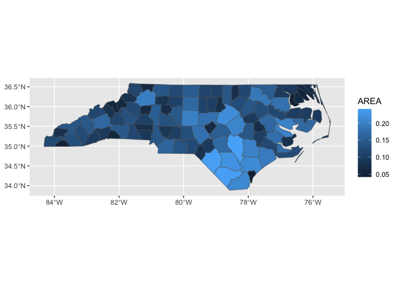
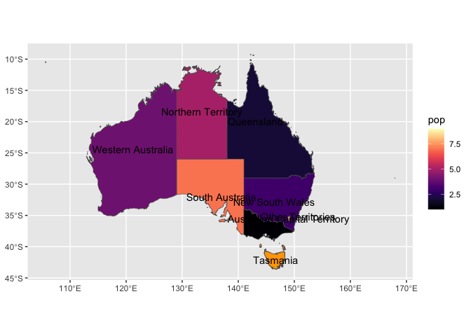
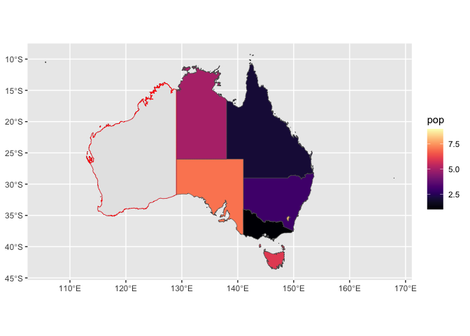
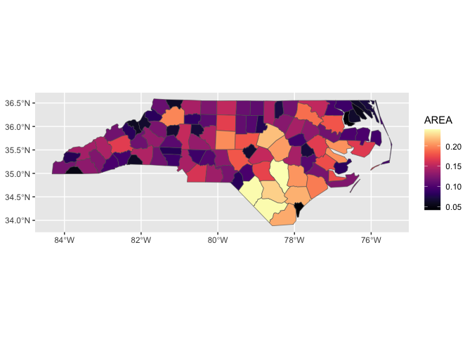

<!-- README.md is generated from README.Rmd. Please edit that file -->

# Rationale

> I am told there are people who do not care for maps, and I find it
> hard to believe. - Robert Louis Stevenson

> My teacher, Mr. Jayson, says a map is a picture of someplace from
> above. It’s like flying over that spot in an airplane. - ‘Lisa’ in
> Loreen Leedy’s in ‘Mappying Penny’s World’

> I hate when I work with spatial data that so much of my mindshare goes
> to thinking about ‘how do I wrangle this this map and what on earth is
> going on’ versus the actual meaning behind what I’m trying to map. -
> Emily Riederer

Maps are some of the most compelling and intuitive data visualizations,
and they are some of the first visualizations people will come across in
their lives. There is great support for mapping in R and data viz
library {ggplot2}.

However, producing a simple map, like a choropleth, can feel much more
effortful than producing other plots, like a scatterplot for example in
ggplot2. A scatter plot is produced by:

``` r
ggplot(scatter_data) + # data
   aes(x = x, y = y) + # position and other visual channel mapping
   geom_point()        # layer 
```

This proposal posits that by investing in methods to easily create new
geo-specific ggplot2 layer extensions (geom\_\*s), producing maps with
ggplot2 can become as intuitive as creating other plot as well as
reading the maps themselves.

> Your API feels like it actually puts the “question” at the center.. -
> Emily Riederer

Proposed regions mapping pseudo code:

``` r
ggplot2(mapping_data) +             # data
   aes(region_id = var1_region_id,  # position mapping 
       fill = var2) +               # and other visual channel mapping
   geom_region()                    # layer
```

Note: foundational work for this package … \[link to spots where this
has been discussed and experiments done\]

# Proposing {ggregions}

A {ggregions} package (in proof of concept phase) will allow geographic
data package writers to easily create easy-to-use ggplot2 layer
extensions that adhere to the ggplot2 ‘grammar’.

First the authors will prepare a reference dataset that contains a
geometry column and columns of allowed identifiers for the regions of
interest. For example, the identifiers from in `us_states_ref` from
`usmapdata::us_map()`, are `state_name`, `fips` and `state_abbr`.

``` r
library(dplyr)

# Step 1. prep some of their geo reference data
us_states_ref <- usmapdata::us_map() |>
  rename(geometry = geom,  # one column with geometry is required
         state_name = full, # state_name will positional aes like x or y 
         state_abbr = abbr) |> # state_abbr will also be optional positional aes like x or y
  select(state_name, everything())

head(us_states_ref)
#> Simple feature collection with 6 features and 3 fields
#> Geometry type: MULTIPOLYGON
#> Dimension:     XY
#> Bounding box:  xmin: -2590847 ymin: -2608148 xmax: 1433830 ymax: -39564.73
#> Projected CRS: NAD27 / US National Atlas Equal Area
#> # A tibble: 6 × 4
#>   state_name fips  state_abbr                                           geometry
#>   <chr>      <chr> <chr>                                      <MULTIPOLYGON [m]>
#> 1 Alaska     02    AK         (((-2396847 -2547721, -2393297 -2546391, -2391552…
#> 2 Alabama    01    AL         (((1093777 -1378535, 1093269 -1374223, 1092965 -1…
#> 3 Arkansas   05    AR         (((483065.2 -927788.2, 506062 -926263.3, 531512.5…
#> 4 Arizona    04    AZ         (((-1388676 -1254584, -1389181 -1251856, -1384522…
#> 5 California 06    CA         (((-1719946 -1090033, -1709611 -1090026, -1700882…
#> 6 Colorado   08    CO         (((-789538.7 -678773.8, -789538.2 -678769.5, -781…
```

Then, authors will be able use `write_geom_region_locale()` to create a
regions-specific ggplot2 layer, for example `geom_us_state()` below,
which can be made available in their geo packages.

``` r
# Step 2. use `write_geom_region_locale`
library(ggregions)
geom_us_state <- write_geom_region_locale(ref_data = us_states_ref)
```

By including the newly specified `geom_` function in their geo data
package (perhaps instead or in addition to a convenience wrapper that
are typical of geo packages) the package *users* will be able to use
the`data + aes + geom` formulation for defining their plots. Instead of
positional aesthetics like x, y or geometry, a region identifier like
`state_name` or `fips` can be used. Internally, the regions `geom_*`
will translate between place name or other identifier to the necessary
polygons.

### Some tabular data with geographic region identifiers, but no boundaries

``` r
us_income <- tidyr::us_rent_income |> 
  filter(variable == "income") |>
  rename(income = estimate)

head(us_income)
#> # A tibble: 6 × 5
#>   GEOID NAME       variable income   moe
#>   <chr> <chr>      <chr>     <dbl> <dbl>
#> 1 01    Alabama    income    24476   136
#> 2 02    Alaska     income    32940   508
#> 3 04    Arizona    income    27517   148
#> 4 05    Arkansas   income    23789   165
#> 5 06    California income    29454   109
#> 6 08    Colorado   income    32401   109
```

### New syntax: data + position and color mapping + layer

``` r
library(ggplot2)
library(usmapdata)

ggplot(data = us_income) + 
  aes(state_name = NAME, 
      fill = income) + 
  geom_us_state()
```

<!-- -->

Packages that might take avantage of ggregion’s functionality include
[afrimapr](https://afrimapr.github.io/afrimapr.website/),
[geobr](https://ipeagit.github.io/geobr/),
[cancensus](https://mountainmath.github.io/cancensus/index.html),
[chilemapas](https://pacha.dev/chilemapas/),
[RCzechia](https://github.com/jlacko/RCzechia),
[geofi](https://ropengov.github.io/geofi/) ,
[geokz](https://github.com/arodionoff/geokz),
[mapsPERU](https://github.com/musajajorge/mapsPERU) and
[geoidep](https://geografo.pe/geoidep/index.html),
[mapSpain](https://github.com/rOpenSpain/mapSpain/),
[geographr](https://github.com/britishredcrosssociety/geographr),
[geouy](https://github.com/RichDeto/geouy),
[tigris](https://github.com/walkerke/tigris), and
[rgeoboundaries](https://github.com/wmgeolab/rgeoboundaries). Since
these geo packages have many users, the impacts of `{ggregions}` could
be significant.

<details>

Dependencies:

- ggplot2
- sf
- dplyr (this could be eliminated in the version for the R consortium)

Potential direct users:

Many packages that provide geographic data and also provide
visualization functionality might find this package useful to provide
functionality in the grammar of graphics frame work.

Downstream user perspective (i.e. users of the package that use
geom\_\*() produced with this method):

## Status Quo: inconsistent apis, or leave the data manipulation to the user

``` r
library(tidyverse)
library(ozmaps)

# some data that we want to viz
au_states <- tribble(~state, ~pop,
        "Victoria", 1,
        "Queensland", 2,
        "New South Wales", 3,
        "Western Australia", 4,
        "Northern Territory", 5,
        "Tasmania", 6,
        "South Australia", 7,
        "Australian Capital Territory", 8,
        "Other Territories", 9
        )

sf_oz <- ozmap("states")

sf_oz |> names()
#> [1] "NAME"     "geometry"

sf_oz |>
  full_join(au_states, by = join_by(NAME == state )) |> 
  ggplot() + 
  aes(geometry = geometry, fill = pop) + 
  geom_sf()
```

# But awkward, so… Step 1. Compute

``` r
australia_state_ref <- sf_oz |>
  select(state_name = NAME)
```

``` r
compute_panel_regions <- function(data, scales, ref_data, keep = NULL, drop = NULL, stamp = F){

ref_data$id <- ref_data[1][[1]]

if(!is.null(keep)){ref_data <- ref_data |> dplyr::filter(id %in% keep)}
if(!is.null(drop)){ref_data <- ref_data |> dplyr::filter(!(id %in% drop))}

ref_data <- ref_data |> 
    ggplot2::StatSf$compute_panel(coord = ggplot2::CoordSf) |>
    ggplot2::StatSfCoordinates$compute_group(coord = ggplot2::CoordSf)

if(!stamp){ ref_data |> dplyr::inner_join(data) } else { ref_data }

}
```

# Test Compute

``` r
au_states |> 
  rename(state_name = state) |>
  compute_panel_regions(ref_data = australia_state_ref)
#> Simple feature collection with 9 features and 9 fields
#> Geometry type: MULTIPOLYGON
#> Dimension:     XY
#> Bounding box:  xmin: 105.5507 ymin: -43.63203 xmax: 167.9969 ymax: -9.229287
#> Geodetic CRS:  GDA94
#> # A tibble: 9 × 10
#>   state_name                  geometry id     xmin  xmax  ymin  ymax     x     y
#>   <chr>             <MULTIPOLYGON [°]> <chr> <dbl> <dbl> <dbl> <dbl> <dbl> <dbl>
#> 1 New South… (((150.7016 -35.12286, 1… New …  106.  168. -43.6 -9.23  146. -32.8
#> 2 Victoria   (((146.6196 -38.70196, 1… Vict…  106.  168. -43.6 -9.23  145. -36.6
#> 3 Queensland (((148.8473 -20.3457, 14… Quee…  106.  168. -43.6 -9.23  143. -19.9
#> 4 South Aus… (((137.3481 -34.48242, 1… Sout…  106.  168. -43.6 -9.23  137. -32.0
#> 5 Western A… (((126.3868 -14.01168, 1… West…  106.  168. -43.6 -9.23  121. -24.4
#> 6 Tasmania   (((147.8397 -40.29844, 1… Tasm…  106.  168. -43.6 -9.23  147. -42.2
#> 7 Northern … (((136.3669 -13.84237, 1… Nort…  106.  168. -43.6 -9.23  133. -18.4
#> 8 Australia… (((149.2317 -35.222, 149… Aust…  106.  168. -43.6 -9.23  149. -35.5
#> 9 Other Ter… (((167.9333 -29.05421, 1… Othe…  106.  168. -43.6 -9.23  151. -35.2
#> # ℹ 1 more variable: pop <dbl>

ggplot(au_states) +
  aes(state_name = state) +
  geom_sf(stat = ggproto(NULL, Stat, 
                         compute_panel = compute_panel_regions), 
          ref_data = australia_state_ref) + 
  aes(fill = pop)
```

<!-- -->

# Step 2. Define Stat

``` r
compute_panel_regions <- function(data, scales, ref_data, keep = NULL, drop = NULL, stamp = F){

ref_data$id <- ref_data[1][[1]]

if(!is.null(keep)){ref_data <- ref_data |> dplyr::filter(id %in% keep)}
if(!is.null(drop)){ref_data <- ref_data |> dplyr::filter(!(id %in% drop))}

ref_data <- ref_data |> 
    ggplot2::StatSf$compute_panel(coord = ggplot2::CoordSf) |>
    ggplot2::StatSfCoordinates$compute_group(coord = ggplot2::CoordSf)

if(!stamp){ ref_data |> dplyr::inner_join(data) } else { ref_data }

}


StatRegion <- ggplot2::ggproto("StatRegion",
                      ggplot2::Stat,
                      compute_panel = compute_panel_regions,
                      default_aes = ggplot2::aes(label = ggplot2::after_stat(id)))
```

# Test Stat

``` r
ggplot(au_states) +
  aes(state_name = state) +
  geom_sf(stat = StatRegion, ref_data = australia_state_ref) + 
  geom_text(stat = StatRegion, ref_data = australia_state_ref) +
  aes(fill = pop)
```

<!-- -->

# Step 3. Define user facing function w/ `make_constructor`… But: coord_sf must be added separately

``` r
geom_state <- make_constructor(GeomSf, stat = StatRegion, ref_data = australia_state_ref)
geom_state_text <- make_constructor(GeomText, stat = StatRegion, ref_data = australia_state_ref)

crs_au_states <- sf::st_crs(sf_oz)

ggplot(au_states) +
  aes(state_name = state) + 
  geom_state() + # errors without coord_sf, and needs the right one
  geom_state_text(check_overlap = T, size = 2) + 
  aes(fill = pop) +
  coord_sf(crs = crs_au_states)
```

<!-- -->

# Step 3.0.1 make geom_region0 (no coords) and friends w/ `make_constructor`… and geom_region (w/ coords)… and friends.

``` r
geom_region0 <- ggplot2::make_constructor(ggplot2::GeomSf, stat = StatRegion) # no crs
stamp_region0 <- ggplot2::make_constructor(ggplot2::GeomSf, stat = StatRegion, stamp = T, inherit.aes = F) # no crs
geom_region_text0 <- ggplot2::make_constructor(ggplot2::GeomText, stat = StatRegion) # no crs
stamp_region_text0 <- ggplot2::make_constructor(ggplot2::GeomText, stat = StatRegion, stamp = T, inherit.aes = F) # no crs
```

``` r
# all the arguments *should* be passed, but this for the sake of demo
geom_region <- function(..., ref_data){
  c(geom_region0(..., ref_data = ref_data), 
    coord_sf(crs = sf::st_crs(ref_data)))
}

# all the arguments *should* be passed, but this for the sake of demo
stamp_region <- function(..., ref_data){
  c(stamp_region0(..., ref_data = ref_data), 
    coord_sf(crs = sf::st_crs(ref_data)))
}

geom_region_text <- function(..., ref_data){
  c(geom_region_text0(..., ref_data = ref_data), 
    coord_sf(crs = sf::st_crs(ref_data)))
}

stamp_region_text <- function(..., ref_data){
  c(stamp_region_text0(..., ref_data = ref_data), 
    coord_sf(crs = sf::st_crs(ref_data)))
}
```

# Step 4. make region-specific user-facing functions!

``` r
# all arguments above that should be passed, could be passed, or, 
geom_au_states <- function(...){geom_region(..., ref_data = australia_state_ref)}
stamp_au_states <- function(...){geom_region(..., ref_data = australia_state_ref)}
geom_au_states_text <- function(...){geom_region_text(..., ref_data = australia_state_ref)}
stamp_au_states_text <- function(...){geom_region_text(..., ref_data = australia_state_ref)}
```

# test!

``` r
au_states |>
ggplot() +
  aes(state_name = state,
      fill = pop) + 
  geom_au_states() +
  geom_au_states(stamp = T,
              keep = "Tasmania", 
              fill = "orange") +
  geom_au_states_text()  
```

<!-- -->

``` r

au_states |>
  ggplot() +
  aes(state_name = state) + 
  geom_au_states(aes(fill = pop)) + 
  stamp_au_states(color = "red", keep = "Western Australia")
```

<!-- -->

## nc test

``` r
nc_ref <- sf::st_read(system.file("shape/nc.shp", package="sf")) |>
  select(county_name = NAME, fips = FIPS)
#> Reading layer `nc' from data source 
#>   `/Library/Frameworks/R.framework/Versions/4.4-x86_64/Resources/library/sf/shape/nc.shp' 
#>   using driver `ESRI Shapefile'
#> Simple feature collection with 100 features and 14 fields
#> Geometry type: MULTIPOLYGON
#> Dimension:     XY
#> Bounding box:  xmin: -84.32385 ymin: 33.88199 xmax: -75.45698 ymax: 36.58965
#> Geodetic CRS:  NAD27

geom_nc_county <- function(...){geom_region(..., ref_data = nc_ref)}

nc_data <- sf::st_read(system.file("shape/nc.shp", package="sf")) |>
  sf::st_drop_geometry()
#> Reading layer `nc' from data source 
#>   `/Library/Frameworks/R.framework/Versions/4.4-x86_64/Resources/library/sf/shape/nc.shp' 
#>   using driver `ESRI Shapefile'
#> Simple feature collection with 100 features and 14 fields
#> Geometry type: MULTIPOLYGON
#> Dimension:     XY
#> Bounding box:  xmin: -84.32385 ymin: 33.88199 xmax: -75.45698 ymax: 36.58965
#> Geodetic CRS:  NAD27

nc_data |>
  ggplot() +
  aes(county_name = NAME,
      fill = AREA) + 
  geom_nc_county()
```

<!-- -->

# `write_geom_region_locale()`

``` r
# all the arguments should be passed
geom_region <- function(mapping = NULL, data = NULL, stat = StatRegion, position = "identity", 
                        ..., legend = NULL, lineend = "butt", linejoin = "round", 
    linemitre = 10, arrow = NULL, arrow.fill = NULL, na.rm = FALSE, 
    show.legend = NA, inherit.aes = TRUE, ref_data){
  
  c(geom_region0(mapping = mapping, data = data, stat = stat, 
        position = position, show.legend = show.legend, inherit.aes = inherit.aes, ref_data = ref_data,
        params = rlang::list2(na.rm = na.rm, legend = legend, lineend = lineend, 
            linejoin = linejoin, linemitre = linemitre, arrow = arrow, 
            arrow.fill = arrow.fill, ...)), 
    coord_sf(crs = sf::st_crs(ref_data)))
  
}

#' @export
write_geom_region_locale <- function(ref_data = australia_state_ref){

  geom_region_local <- geom_region

formals(geom_region_local)$ref_data <- substitute(ref_data)

return(geom_region_local)

}
```

# Australia example…

``` r
geom_au_state <- write_geom_region_locale(ref_data = australia_state_ref)

geom_au_state
#> function (mapping = NULL, data = NULL, stat = StatRegion, position = "identity", 
#>     ..., legend = NULL, lineend = "butt", linejoin = "round", 
#>     linemitre = 10, arrow = NULL, arrow.fill = NULL, na.rm = FALSE, 
#>     show.legend = NA, inherit.aes = TRUE, ref_data = australia_state_ref) 
#> {
#>     c(geom_region0(mapping = mapping, data = data, stat = stat, 
#>         position = position, show.legend = show.legend, inherit.aes = inherit.aes, 
#>         ref_data = ref_data, params = rlang::list2(na.rm = na.rm, 
#>             legend = legend, lineend = lineend, linejoin = linejoin, 
#>             linemitre = linemitre, arrow = arrow, arrow.fill = arrow.fill, 
#>             ...)), coord_sf(crs = sf::st_crs(ref_data)))
#> }

au_states |> 
  ggplot() + 
  aes(state_name = state, fill = pop) + 
  geom_au_state()
```

<!-- -->

``` r

geom_au_state
#> function (mapping = NULL, data = NULL, stat = StatRegion, position = "identity", 
#>     ..., legend = NULL, lineend = "butt", linejoin = "round", 
#>     linemitre = 10, arrow = NULL, arrow.fill = NULL, na.rm = FALSE, 
#>     show.legend = NA, inherit.aes = TRUE, ref_data = australia_state_ref) 
#> {
#>     c(geom_region0(mapping = mapping, data = data, stat = stat, 
#>         position = position, show.legend = show.legend, inherit.aes = inherit.aes, 
#>         ref_data = ref_data, params = rlang::list2(na.rm = na.rm, 
#>             legend = legend, lineend = lineend, linejoin = linejoin, 
#>             linemitre = linemitre, arrow = arrow, arrow.fill = arrow.fill, 
#>             ...)), coord_sf(crs = sf::st_crs(ref_data)))
#> }
```

# us state example

``` r
us_states_ref <- usmapdata::us_map() |>
  rename(geometry = geom,
         state_name = full,
         state_abbr = abbr) |>
  select(state_name, everything())
  
geom_us_state <- write_geom_region_locale(ref_data = us_states_ref)

us_rent_income |> 
  filter(variable == "income") |>
  ggplot() + 
  aes(state_name = NAME, fill = estimate) + 
  geom_us_state() + 
  scale_fill_viridis_c(option = "magma")
```

<!-- -->

## Minimal packaging…

``` r
devtools::create(".")
```

``` r
knitrExtra::chunk_to_dir("StatRegion")
knitrExtra::chunk_to_dir("geom_region0")
knitrExtra::chunk_to_dir("write_geom_region_locale")

usethis::use_package("ggplot2")
usethis::use_package("sf")
usethis::use_package("dplyr")
```

``` r
devtools::document()
devtools::check(".")
devtools::install(pkg = ".", upgrade = "never")
```

</details>
