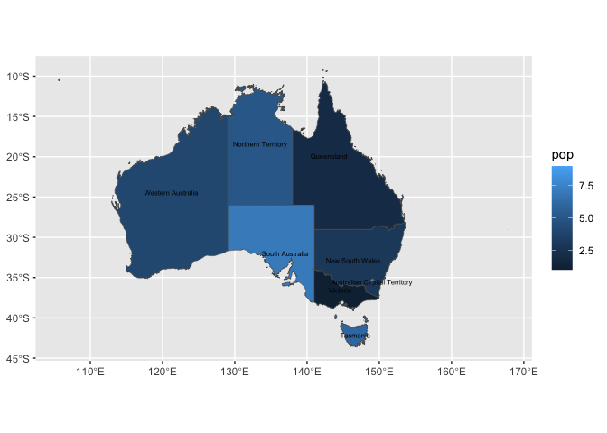
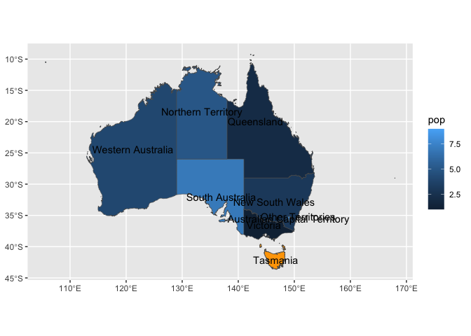

- [Intro Thoughts](#intro-thoughts)
- [Status Quo](#status-quo)
- [But awkward, so… Step 1. Compute](#but-awkward-so-step-1-compute)
- [Test Compute](#test-compute)
- [Step 2. Define Stat](#step-2-define-stat)
- [Test Stat](#test-stat)
- [Step 3. Define user facing function w/ `make_constructor`… But:
  coord_sf must be added
  separately](#step-3-define-user-facing-function-w-make_constructor-but-coord_sf-must-be-added-separately)
- [Step 3.0.1 make geom_region0 (no coords) and friends w/
  `make_constructor`… and geom_region (w/ coords)… and
  friends.](#step-301-make-geom_region0-no-coords-and-friends-w-make_constructor-and-geom_region-w-coords-and-friends)
- [Step 4. make region-specific user-facing
  functions!](#step-4-make-region-specific-user-facing-functions)
- [test!](#test)
  - [nc test](#nc-test)
- [epiloge, something nicer for for geom_region -\> geom_province,
  geom_state, etc?
  `specify_geom_region()`](#epiloge-something-nicer-for-for-geom_region---geom_province-geom_state-etc-specify_geom_region)
- [us state example](#us-state-example)
  - [Closing remarks, Other Relevant Work,
    Caveats](#closing-remarks-other-relevant-work-caveats)

<!-- README.md is generated from README.Rmd. Please edit that file -->

## Intro Thoughts

## Status Quo

``` r
library(tidyverse)
#> ── Attaching core tidyverse packages ──────────────────────── tidyverse 2.0.0 ──
#> ✔ dplyr     1.1.4          ✔ readr     2.1.5     
#> ✔ forcats   1.0.0          ✔ stringr   1.5.1     
#> ✔ ggplot2   3.5.2.9002     ✔ tibble    3.2.1     
#> ✔ lubridate 1.9.3          ✔ tidyr     1.3.1     
#> ✔ purrr     1.0.2          
#> ── Conflicts ────────────────────────────────────────── tidyverse_conflicts() ──
#> ✖ dplyr::filter() masks stats::filter()
#> ✖ dplyr::lag()    masks stats::lag()
#> ℹ Use the conflicted package (<http://conflicted.r-lib.org/>) to force all conflicts to become errors
library(ozmaps)

# some data that we want to viz
au_states <- tribble(~state, ~pop,
        "Victoria", 1,
        "Queensland", 2,
        "New South Wales", 3,
        "Western Australia", 4,
        "Northern Territory", 5,
        "Tasmania", 6,
        "South Australia", 7,
        "Australian Capital Territory", 8,
        "Other Territories", 9
        )

sf_oz <- ozmap("states")
```

<!-- -->

``` r

sf_oz |> names()
#> [1] "NAME"     "geometry"

sf_oz |>
  full_join(au_states, by = join_by(NAME == state )) |> 
  ggplot() + 
  aes(geometry = geometry, fill = pop) + 
  geom_sf()
```

<!-- -->

# But awkward, so… Step 1. Compute

``` r
australia_state_ref <- sf_oz |>
  select(state_name = NAME)


compute_panel_regions <- function(data, scales, ref_data, keep = NULL, drop = NULL, stamp = F){

ref_data$id <- ref_data[1][[1]]

if(!is.null(keep)){ref_data <- ref_data |> filter(id %in% keep)}
if(!is.null(drop)){ref_data <- ref_data |> filter(!(id %in% drop))}

ref_data <- ref_data |> 
    ggplot2::StatSf$compute_panel(coord = ggplot2::CoordSf) |>
    ggplot2::StatSfCoordinates$compute_group(coord = ggplot2::CoordSf)

if(!stamp){ ref_data |> inner_join(data) } else { ref_data }

}
```

# Test Compute

``` r
au_states |> 
  rename(state_name = state) |>
  compute_panel_regions(ref_data = australia_state_ref)
#> Warning in st_point_on_surface.sfc(sf::st_zm(x)): st_point_on_surface may not
#> give correct results for longitude/latitude data
#> Joining with `by = join_by(state_name)`
#> Simple feature collection with 9 features and 9 fields
#> Geometry type: MULTIPOLYGON
#> Dimension:     XY
#> Bounding box:  xmin: 105.5507 ymin: -43.63203 xmax: 167.9969 ymax: -9.229287
#> Geodetic CRS:  GDA94
#> # A tibble: 9 × 10
#>   state_name                  geometry id     xmin  xmax  ymin  ymax     x     y
#>   <chr>             <MULTIPOLYGON [°]> <chr> <dbl> <dbl> <dbl> <dbl> <dbl> <dbl>
#> 1 New South… (((150.7016 -35.12286, 1… New …  106.  168. -43.6 -9.23  146. -32.8
#> 2 Victoria   (((146.6196 -38.70196, 1… Vict…  106.  168. -43.6 -9.23  145. -36.6
#> 3 Queensland (((148.8473 -20.3457, 14… Quee…  106.  168. -43.6 -9.23  143. -19.9
#> 4 South Aus… (((137.3481 -34.48242, 1… Sout…  106.  168. -43.6 -9.23  137. -32.0
#> 5 Western A… (((126.3868 -14.01168, 1… West…  106.  168. -43.6 -9.23  121. -24.4
#> 6 Tasmania   (((147.8397 -40.29844, 1… Tasm…  106.  168. -43.6 -9.23  147. -42.2
#> 7 Northern … (((136.3669 -13.84237, 1… Nort…  106.  168. -43.6 -9.23  133. -18.4
#> 8 Australia… (((149.2317 -35.222, 149… Aust…  106.  168. -43.6 -9.23  149. -35.5
#> 9 Other Ter… (((167.9333 -29.05421, 1… Othe…  106.  168. -43.6 -9.23  151. -35.2
#> # ℹ 1 more variable: pop <dbl>

ggplot(au_states) +
  aes(state_name = state) +
  geom_sf(stat = ggproto(NULL, Stat, 
                         compute_panel = compute_panel_regions), 
          ref_data = australia_state_ref) + 
  aes(fill = pop)
#> Warning in st_point_on_surface.sfc(sf::st_zm(x)): st_point_on_surface may not
#> give correct results for longitude/latitude data
#> Joining with `by = join_by(state_name)`
```

<!-- -->

# Step 2. Define Stat

``` r
StatRegion <- ggproto("StatRegion",
                      Stat,
                      compute_panel = compute_panel_regions,
                      default_aes = aes(label = after_stat(id)))
```

# Test Stat

``` r
ggplot(au_states) +
  aes(state_name = state) +
  geom_sf(stat = StatRegion) + 
  geom_text(stat = StatRegion) +
  aes(fill = pop)
#> Warning: Computation failed in `stat_region()`.
#> Computation failed in `stat_region()`.
#> Caused by error in `compute_panel()`:
#> ! argument "ref_data" is missing, with no default
```

<!-- -->

# Step 3. Define user facing function w/ `make_constructor`… But: coord_sf must be added separately

``` r
geom_state <- make_constructor(GeomSf, stat = StatRegion, ref_data = australia_state_ref)
geom_state_text <- make_constructor(GeomText, stat = StatRegion, ref_data = australia_state_ref)

crs_au_states <- sf::st_crs(sf_oz)

ggplot(au_states) +
  aes(state_name = state) + 
  geom_state() + # errors without coord_sf, and needs the right one
  geom_state_text(check_overlap = T, size = 2) + 
  aes(fill = pop) +
  coord_sf(crs = crs_au_states)
#> Warning in st_point_on_surface.sfc(sf::st_zm(x)): st_point_on_surface may not
#> give correct results for longitude/latitude data
#> Joining with `by = join_by(state_name)`
#> Warning in st_point_on_surface.sfc(sf::st_zm(x)): st_point_on_surface may not
#> give correct results for longitude/latitude data
#> Joining with `by = join_by(state_name)`
```

<!-- -->

# Step 3.0.1 make geom_region0 (no coords) and friends w/ `make_constructor`… and geom_region (w/ coords)… and friends.

``` r
geom_region0 <- make_constructor(GeomSf, stat = StatRegion) # no crs
stamp_region0 <- make_constructor(GeomSf, stat = StatRegion, stamp = T, inherit.aes = F) # no crs
geom_region_text0 <- make_constructor(GeomText, stat = StatRegion) # no crs
stamp_region_text0 <- make_constructor(GeomText, stat = StatRegion, stamp = T, inherit.aes = F) # no crs

# all the arguments *should* be passed, but this for the sake of demo
geom_region <- function(..., ref_data){
  c(geom_region0(..., ref_data = ref_data), 
    coord_sf(crs = sf::st_crs(ref_data)))
}

# all the arguments *should* be passed, but this for the sake of demo
stamp_region <- function(..., ref_data){
  c(stamp_region0(..., ref_data = ref_data), 
    coord_sf(crs = sf::st_crs(ref_data)))
}

geom_region_text <- function(..., ref_data){
  c(geom_region_text0(..., ref_data = ref_data), 
    coord_sf(crs = sf::st_crs(ref_data)))
}

stamp_region_text <- function(..., ref_data){
  c(stamp_region_text0(..., ref_data = ref_data), 
    coord_sf(crs = sf::st_crs(ref_data)))
}
```

# Step 4. make region-specific user-facing functions!

``` r
# all arguments above that should be passed, could be passed, or, 
geom_au_states <- function(...){geom_region(..., ref_data = australia_state_ref)}
stamp_au_states <- function(...){geom_region(..., ref_data = australia_state_ref)}
geom_au_states_text <- function(...){geom_region_text(..., ref_data = australia_state_ref)}
stamp_au_states_text <- function(...){geom_region_text(..., ref_data = australia_state_ref)}
```

# test!

``` r
au_states |>
ggplot() +
  aes(state_name = state,
      fill = pop) + 
  geom_au_states() +
  geom_au_states(stamp = T,
              keep = "Tasmania", 
              fill = "orange") +
  geom_au_states_text()  
#> Coordinate system already present.
#> ℹ Adding new coordinate system, which will replace the existing one.
#> Coordinate system already present.
#> ℹ Adding new coordinate system, which will replace the existing one.
#> Warning in st_point_on_surface.sfc(sf::st_zm(x)): st_point_on_surface may not
#> give correct results for longitude/latitude data
#> Joining with `by = join_by(state_name)`
#> Warning in st_point_on_surface.sfc(sf::st_zm(x)): st_point_on_surface may not
#> give correct results for longitude/latitude data
#> Warning in st_point_on_surface.sfc(sf::st_zm(x)): st_point_on_surface may not
#> give correct results for longitude/latitude data
#> Joining with `by = join_by(state_name)`
```

<!-- -->

``` r

au_states |>
  ggplot() +
  aes(state_name = state) + 
  geom_au_states(aes(fill = pop)) + 
  stamp_au_states(color = "red", keep = "Western Australia")
#> Coordinate system already present.
#> ℹ Adding new coordinate system, which will replace the existing one.
#> Warning in st_point_on_surface.sfc(sf::st_zm(x)): st_point_on_surface may not
#> give correct results for longitude/latitude data
#> Joining with `by = join_by(state_name)`
#> Warning in st_point_on_surface.sfc(sf::st_zm(x)): st_point_on_surface may not
#> give correct results for longitude/latitude data
#> Joining with `by = join_by(state_name)`
```

<!-- -->

## nc test

``` r
nc_ref <- sf::st_read(system.file("shape/nc.shp", package="sf")) |>
  select(county_name = NAME, fips = FIPS)
#> Reading layer `nc' from data source 
#>   `/Library/Frameworks/R.framework/Versions/4.4-x86_64/Resources/library/sf/shape/nc.shp' 
#>   using driver `ESRI Shapefile'
#> Simple feature collection with 100 features and 14 fields
#> Geometry type: MULTIPOLYGON
#> Dimension:     XY
#> Bounding box:  xmin: -84.32385 ymin: 33.88199 xmax: -75.45698 ymax: 36.58965
#> Geodetic CRS:  NAD27

geom_nc_county <- function(...){geom_region(..., ref_data = nc_ref)}

nc_data <- sf::st_read(system.file("shape/nc.shp", package="sf")) |>
  sf::st_drop_geometry()
#> Reading layer `nc' from data source 
#>   `/Library/Frameworks/R.framework/Versions/4.4-x86_64/Resources/library/sf/shape/nc.shp' 
#>   using driver `ESRI Shapefile'
#> Simple feature collection with 100 features and 14 fields
#> Geometry type: MULTIPOLYGON
#> Dimension:     XY
#> Bounding box:  xmin: -84.32385 ymin: 33.88199 xmax: -75.45698 ymax: 36.58965
#> Geodetic CRS:  NAD27

nc_data |>
  ggplot() +
  aes(county_name = NAME,
      fill = AREA) + 
  geom_nc_county()
#> Warning in st_point_on_surface.sfc(sf::st_zm(x)): st_point_on_surface may not
#> give correct results for longitude/latitude data
#> Joining with `by = join_by(county_name)`
```

<!-- -->

# epiloge, something nicer for for geom_region -\> geom_province, geom_state, etc? `specify_geom_region()`

``` r
geom_region0
#> function (mapping = NULL, data = NULL, stat = StatRegion, position = "identity", 
#>     ..., legend = NULL, lineend = "butt", linejoin = "round", 
#>     linemitre = 10, arrow = NULL, arrow.fill = NULL, na.rm = FALSE, 
#>     show.legend = NA, inherit.aes = TRUE) 
#> {
#>     layer(mapping = mapping, data = data, geom = "sf", stat = stat, 
#>         position = position, show.legend = show.legend, inherit.aes = inherit.aes, 
#>         params = list2(na.rm = na.rm, legend = legend, lineend = lineend, 
#>             linejoin = linejoin, linemitre = linemitre, arrow = arrow, 
#>             arrow.fill = arrow.fill, ...))
#> }
#> <environment: 0x7fde990fae80>

# all the arguments should be passed
geom_region <- function(mapping = NULL, data = NULL, stat = StatRegion, position = "identity", 
                        ..., legend = NULL, lineend = "butt", linejoin = "round", 
    linemitre = 10, arrow = NULL, arrow.fill = NULL, na.rm = FALSE, 
    show.legend = NA, inherit.aes = TRUE, ref_data){
  
  c(geom_region0(mapping = mapping, data = data, stat = stat, 
        position = position, show.legend = show.legend, inherit.aes = inherit.aes, ref_data = ref_data,
        params = rlang::list2(na.rm = na.rm, legend = legend, lineend = lineend, 
            linejoin = linejoin, linemitre = linemitre, arrow = arrow, 
            arrow.fill = arrow.fill, ...)), 
    coord_sf(crs = sf::st_crs(ref_data)))
  
}


write_geom_region_locale <- function(ref_data = australia_state_ref){

geom_region_local <- geom_region

formals(geom_region_local)$ref_data <- substitute(ref_data)

return(geom_region_local)

}


geom_au_state <- write_geom_region_locale(ref_data = australia_state_ref)

geom_au_state
#> function (mapping = NULL, data = NULL, stat = StatRegion, position = "identity", 
#>     ..., legend = NULL, lineend = "butt", linejoin = "round", 
#>     linemitre = 10, arrow = NULL, arrow.fill = NULL, na.rm = FALSE, 
#>     show.legend = NA, inherit.aes = TRUE, ref_data = australia_state_ref) 
#> {
#>     c(geom_region0(mapping = mapping, data = data, stat = stat, 
#>         position = position, show.legend = show.legend, inherit.aes = inherit.aes, 
#>         ref_data = ref_data, params = rlang::list2(na.rm = na.rm, 
#>             legend = legend, lineend = lineend, linejoin = linejoin, 
#>             linemitre = linemitre, arrow = arrow, arrow.fill = arrow.fill, 
#>             ...)), coord_sf(crs = sf::st_crs(ref_data)))
#> }

au_states |> 
  ggplot() + 
  aes(state_name = state, fill = pop) + 
  geom_au_state()
#> Warning in geom_region0(mapping = mapping, data = data, stat = stat, position =
#> position, : Ignoring unknown parameters: `params`
#> Warning in st_point_on_surface.sfc(sf::st_zm(x)): st_point_on_surface may not
#> give correct results for longitude/latitude data
#> Joining with `by = join_by(state_name)`
```

<!-- -->

``` r

geom_au_state
#> function (mapping = NULL, data = NULL, stat = StatRegion, position = "identity", 
#>     ..., legend = NULL, lineend = "butt", linejoin = "round", 
#>     linemitre = 10, arrow = NULL, arrow.fill = NULL, na.rm = FALSE, 
#>     show.legend = NA, inherit.aes = TRUE, ref_data = australia_state_ref) 
#> {
#>     c(geom_region0(mapping = mapping, data = data, stat = stat, 
#>         position = position, show.legend = show.legend, inherit.aes = inherit.aes, 
#>         ref_data = ref_data, params = rlang::list2(na.rm = na.rm, 
#>             legend = legend, lineend = lineend, linejoin = linejoin, 
#>             linemitre = linemitre, arrow = arrow, arrow.fill = arrow.fill, 
#>             ...)), coord_sf(crs = sf::st_crs(ref_data)))
#> }
```

# us state example

``` r
us_states_ref <- usmapdata::us_map() |>
  rename(geometry = geom,
         state_name = full,
         state_abbr = abbr) |>
  select(state_name, everything())
  

geom_us_state <- write_geom_region_locale(ref_data = us_states_ref)

us_rent_income |> 
  filter(variable == "income") |>
  ggplot() + 
  aes(state_name = NAME, fill = estimate) + 
  geom_us_state() + 
  scale_fill_viridis_c(option = "magma")
#> Warning in geom_region0(mapping = mapping, data = data, stat = stat, position =
#> position, : Ignoring unknown parameters: `params`
#> Joining with `by = join_by(state_name)`
```

<!-- -->

## Closing remarks, Other Relevant Work, Caveats
